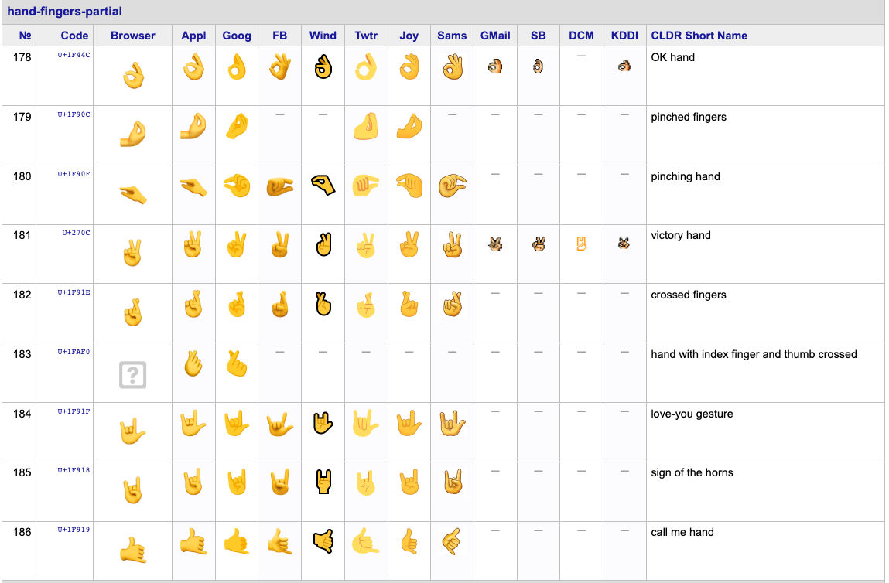
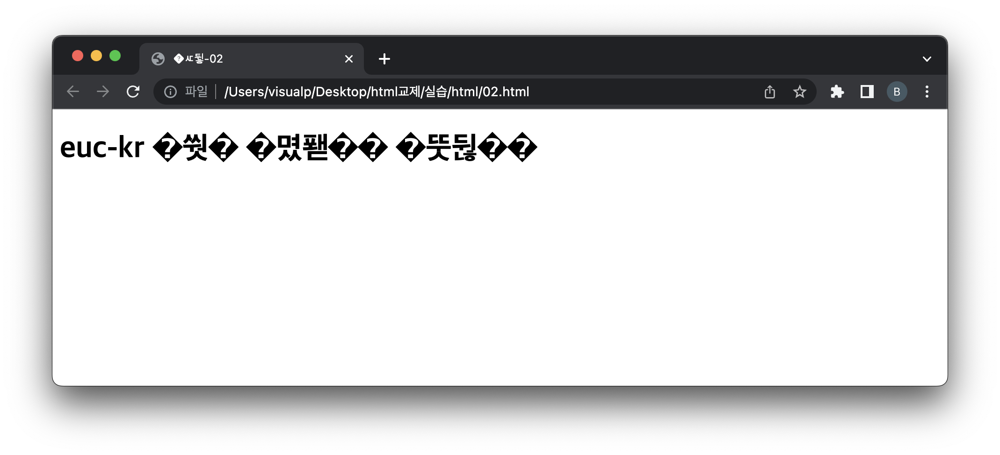

= Character Sets and Encodings

* *글자나 기호들의 집합을 숫자로 정의.*

== 아스키(ASCII)

* 영문 알파벳을 사용하는 대표적인 문자 인코딩
* 7bit 인코딩
* 128개의 문자열로 이루어져 있음
** 영문 : 52
** 숫자:10
** 특수문자:32
** 제어문자 : 33
** 000 0000 ~ 111 1111
* https://ko.wikipedia.org/wiki/ASCII
* 한글은 표현 불가능..

== 1Byte -&gt; 8bit

*2BYTE-&gt; 16bit*

== EUC-KR

* 한글 완성형 인코딩
* 8bit 문자 인코딩
* https://uic.io/ko/charset/show/euc-kr/
* *한글, 영어 사용하는 페이지에 적합*
* 한글은 2byte를 사용하는 문자 집합
** 16bit
** 1 + 초성(5bit) + 중성(5bit) + 종성(5bit)

== UTF-8 ( 유니코드 )

* 전세계의 모든 문자열을 하나의 코드표로 통합
* 한 문자를 저장하기 위해서 최소 1byte에서 최대 4byte 까지 동적으로 사용합니다.
** 조합형
*** 한글의 제작 원리에 기반하여 초성, 중성, 종성에 각각 코드를 할당하는 방식
** 완성형
*** '가','나','다'와 같이 완성형 문자열에 코드를 할당하는 방식
*** 한글 표준안
* emoji
** 일본의 휴대폰 문자 메시지에서 시작된 그림문자.
** https://unicode.org/emoji/charts/full-emoji-list.html#

== charset이 잘못되면 생기는 일.

* charset = euc-kr, 파일은 UTF-8 인코딩이면..
* 또는 charset=utf-8 파일은 euc-kr 이면 ..

[source,html]
----
<!DOCTYPE html>
<html lang="ko">
    <head>
        <meta charset="euc-kr" />
        <title>실습-02</title>
    </head>
    <body>
        <h1>euc-kr 한글 인코딩 테스트</h1>
    </body>

</html>
----

