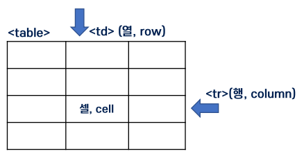
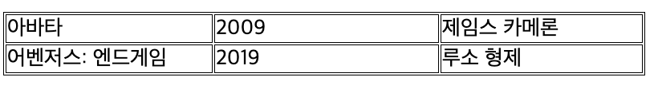
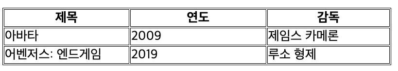
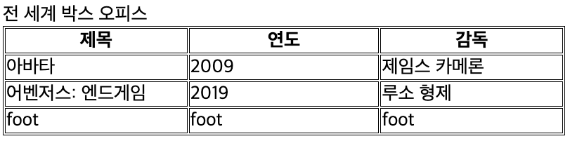
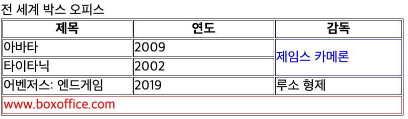

= table ( 테이블 )

== 웹 문서에서 자료를 정리할 때 가장 많이 사용하는 태그

* &lt;table&gt; 태그로 테이블을 시작
* &lt;tr&gt; 태그로 테이블을 시작
* &lt;td&gt; 태그로 행을 만듦
* *&lt;th&gt; 태그는 셀의 문자를 가운데 굵게 표시(제목에 사용)*

== table - basic

[source,html]
----
<table border="1">
    <tr>
        <td>아바타</td> <td>2009</td> <td>제임스 카메론</td>
    </tr> 
    <tr>
        <td>어벤저스: 엔드게임</td> <td>2019</td>
        <td>루소 형제</td>
    </tr>
</table>

----

== 테이블의 구조 지정

* &lt;caption&gt; 테이블의 제목 지정
* &lt;thead&gt; 테이블 헤더 지정
* &lt;tbody&gt; 테이블의 내용
* &lt;tfoot&gt; 테이블의 푸터 지정

== table-header(제목, 연도, 감독 )

[source,html]
----
<table border="1">
    <thread>
        <tr>
            <th>제목</th>
            <th>연도</th>
            <th>감독</th>
        </tr>
    </thead>

    <tr>
        <td>아바타</td>
        <td>2009</td>
        <td>제임스 카메론</td>
    </tr>
    <tr>
        <td>어벤저스: 엔드게임</td>
        <td>2019</td>
        <td>루소 형제</td>
    </tr>
</table>
----

== table - 구조지정

[source,html]
----

<table>
    <catpion>전 세계 박스 오피스</catpion>
    <thead>
        <tr>
            <th>제목</th>
            <th>연도</th>
            <th>감독</th>
        </tr>
    </thead>
    <tbody>
        <tr>
            <td>아바타</td>
            <td>2009</td>
            <td>제임스 카메론</td>
        </tr>
        <tr>
            <td>어벤저스: 엔드게임</td>
            <td>2019</td>
            <td>루소 형제</td>
        </tr>
    </tbody>
    <tfoot>
        <tr>
            <td>foot</td>
            <td>foot</td>
            <td>foot</td>
        </tr>
    </tfoot>
</table>
----

== 행 합치기 : colspan, 열 합치기 : rowspan

[source,html]
----

<table>
    <catpion>전 세계 박스 오피스</catpion>
    <thead>
        <tr>
            <th>제목</th>
            <th>연도</th>
            <th>감독</th>
        </tr>
    </thead>
    <tbody>
        <tr>
            <td>아바타</td>
            <td>2009</td>
            <td rowspan="2" class="border-blue">제임스 카메론</td>
        </tr>
        <tr>
            <td>타이타닉</td>
            <td>2002</td>
        </tr>
        <tr>
            <td>어벤저스: 엔드게임</td>
            <td>2019</td>
            <td>루소 형제</td>
        </tr>
    </tbody>
    <tfoot>
        <tr>
            <td colspan="3" class="border-red">www.boxoffice.com</td>
        </tr>
    </tfoot>
</table>
----

== table 속성

* https://developer.mozilla.org/ko/docs/Web/HTML/Element/table#%EB%B8%8C%EB%9D%BC%EC%9A%B0%EC%A0%80_%ED%98%B8%ED%99%98%EC%84%B1

|===
|태그 |설명 |HTML5 지원 

|border |테이블의 경계선 굵기를 지정 ( ex. border="10"  ) | 
|width |테이블의 너비를 지정 |NO 
|height |테이블의 높이를 지정 | 
|cellpadding |셀과 경계선 사이의 여백 |NO 
|cellspacing |셀과 셀 사이의 여백 |NO 
|align |셀의 가로 줄을 오른쪽(right), 왼쪽(left), 중앙(center) 등으로 정렬 |NO 
|valign |셀의 세로 줄을 위(top), 중앙(middle), 아래(bottom)등으로 정렬 | 
|bgcolor |배경색 지정 |NO 
|border-color |경계선 색상 지정 | 
|===