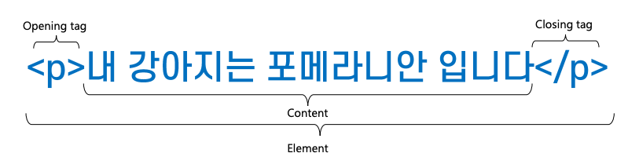
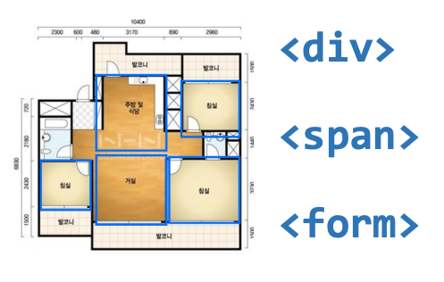
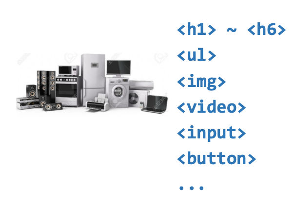
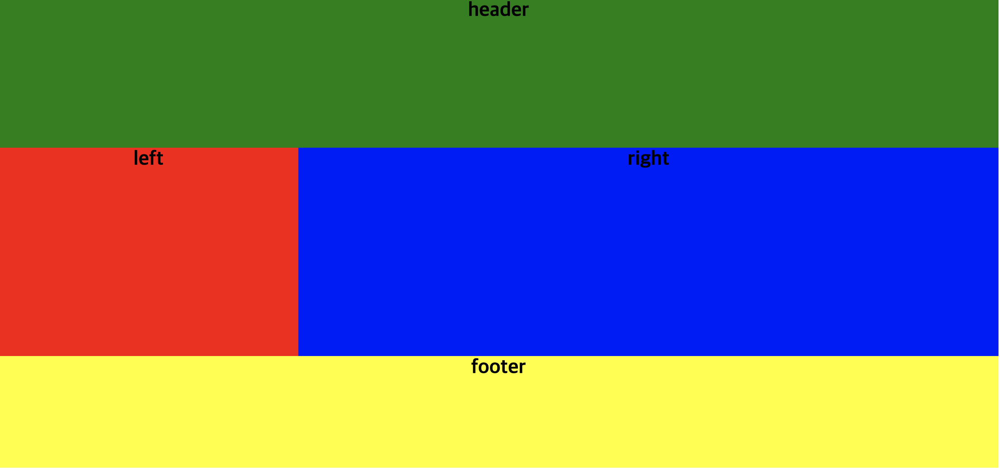
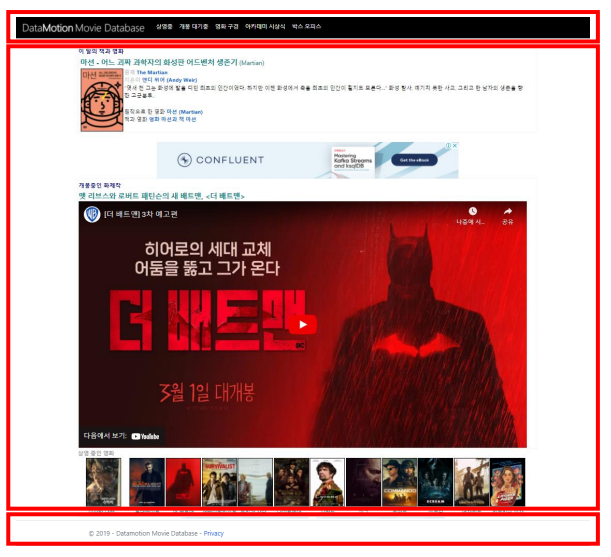

= Element

== Opening tag , Closing tag

== 영역을 나누는 태그

* div
* span
* form

== 내용을 표현하는 태그

* H1 ~ H6
* Ul
* img
* video
* input
* button

== 

* 자체만으로는 어떠한 의미도 가지지 않음
* class, id의 전역 속성으로 스타일링을 위해 요소들을 그룹화
* *Inline level element*

== &lt;div&gt;

* Division의 약자, 웹 사이트의 레이아웃을 만들 때 사용하는 태그
* 웹 페이지에서 논리적 구분을 정의
* 각각의 블록(공간)을 알맞게 배치하고 CSS  스타일을 적용
* *Block level element*

[source,html]
----

    
header

    
left

    
right

    

    
footer

----

== Page Layout

