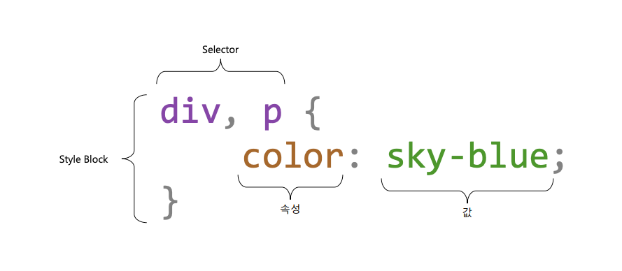
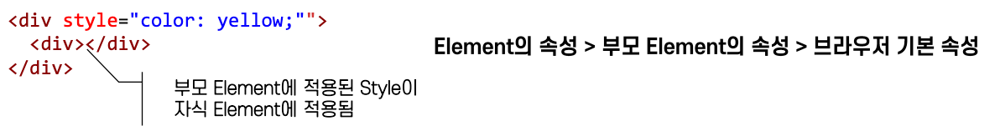

= CSS란?

== Cascading Style Sheet

* Cascading : 폭포처럼 위에서 아래로 흐르는…, 상속 또는 종속하는 ..
* 문서의 표현을 기술하는 스타일 시트 언어

== CSS 적용

=== Inline

* 각 태그마다 스타일을 모두 적어야 하므로 관리가 쉽지 않음
* 우선 순위가 가장 높기 때문에 특별한 경우가 아니면 쓰지 말아야 함
* 메일 본문 스타일을 만들 때 주로 사용

[source,html]
----

----

=== Embeded

* 보통 head안에 Style을 감싸서 넣음
* CSS가 간단한 페이지 일 경우 사용
* 사용자에게 초기 로딩시 보여주는 화면을 구성할 때 사용

[source,html]
----
<head>
    
</head>
----

=== External

* 별도의 CSS 파일로 분리
* 관심사 분리와 재사용이 가능
* 가장 많이 사용하는 방법

[source,html]
----
<link rel="stylesheet" href=""../src/css/index.css>
----

== CSS 상속

== CSS 상속되는 속성과 안되는 속성

* https://www.w3.org/TR/CSS21/propidx

|===
|속성 |상속여부 

|width/height |no
|margin |no
|padding |no
|border |no
|box-sizing |no
|display |no
|visibility |yes
|opacity |yes
|background |no
|font |yes
|color |yes
|line-height |yes
|text-align |yes
|vertical-align |no
|text-decoration |no
|white-space |yes
|position |no
|top/right/bottom/left |no
|z-index |no
|overflow |no
|float |no
|===

[source,html]
----
<!DOCTYPE html>
<html>
<head>
  <meta charset="utf-8">
  
</head>
<body>
  

    
div-main

    

        div-sub
    

    
button tag는 color, font-size, text-align:ceter 상속안되는 element

    <button>버튼</button>
  

</body>
</html>
----

=== Button tag처럼 요소에 따라서 상속받지 않는 경우도 존재합니다.