= Display

== 한 라인을 모두 차지

* 한 라인을 모두 차지

[source,html]
----

안녕하세요

안녕하세요

안녕하세요

----

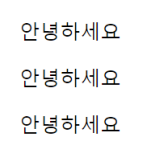

* width, height, margin, padding 속성 동작

[source,html]
----
p {
    margin: 10px;
    padding: 10px;
    width: 150px;
    height: 30px;
    background-color: azure; 
}
----

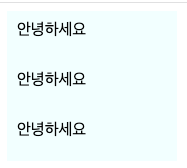

* margin:x auto;

[source,html]
----
p {
    margin: 0 auto;
    width: 150px;
    background-color: azure;
}
----

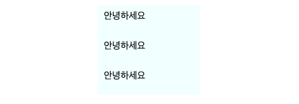

== Inline 레벨 특성

* 여려 요소가 한 행에 있을 수 있음
** &lt;span&gt;….&lt;/span&gt;&lt;span&gt;….&lt;/span&gt;
* *width, height, margin, top, bottom 동작 안 함*
* text-align:center 가운데 정렬은 동작합니다.

[source,html]
----

    rookie
    rookie
    span은 width, height, margin, top, bottom 동작 안 함

----

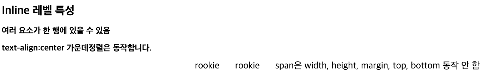

== Inline-block

* Block 레벨 요소도 여러 요소와 같이 한 행에 있을 수 있습니다.
** display: inline-block;

[source,html]
----
 

안녕하세요

안녕하세요

안녕하세요

baseball
baseball
----

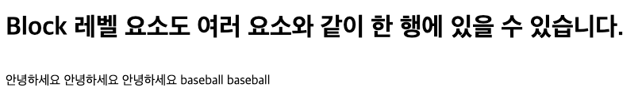

* Inline 레벨 요소도 width, height, margin, padding을 모두 가질 수 있습니다.

[source,html]
----

----

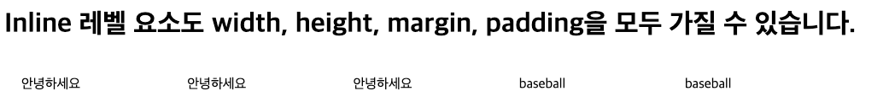

* 부모 Element의 text-align:center로 가운데 정렬

[source,html]
----

    
안녕하세요

    
안녕하세요

    
안녕하세요

    baseball
    baseball

----

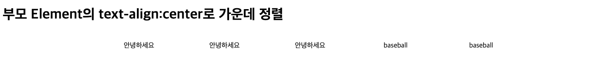

== display:none

* 해당 Element를 화면에서 보이지 않게 함
[source,html]
----

----

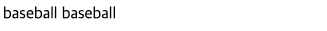

## `visibility:hidden`
* `visibiliy:hidden`은 `display:none` 비슷하지만 공간을 차지하는 특징이 있습니다.

[source,html]
----

<table>
    <tr>
        <td>1.1</td>
        <td class="td_hidden">1.2</td>
        <td>1.3</td>
    </tr>
    <tr class="td_hidden">
        <td>2.1</td>
        <td>2.2</td>
        <td>2.3</td>
    </tr>
    <tr>
        <td>3.1</td>
        <td>3.2</td>
        <td>3.3</td>
    </tr>
</table>
----

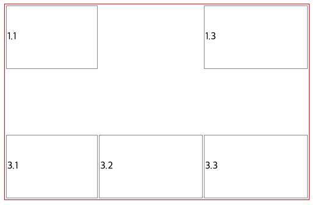

## flexible 박스

* 유연하게 조정한다는 뜻의 새로운 display 속성
* HTML5에서 추가 - 모든 모던 브라우저에서 지원
* flexbox는 부모 요소인 container와 자식요소인 flex item으로 구성됩니다.
* mdn - https://developer.mozilla.org/ko/docs/Learn/CSS/CSS_layout/Flexbox

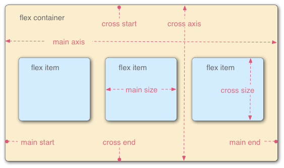

* 컨테이너에 적용하는 속성
** flex-direction:row ( default ) , 가로방향+
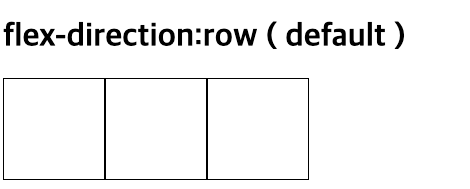

** flex-direction:column , 세로방향 +
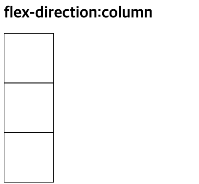

[source,html]
----

    

    

    

    

    

    

----

* flex:{숫자} : 숫자 비율만큼 공간 차지
* 공간을 배치한 후에 남는 공간을 유동적으로 조절 가능
* flex:2 의미?
    ** **증가너비(flex-grow), 감소너비(flex-shrink), 기본너비(flex-basis)를 한꺼번에 나타내는 단축 속성**
* nth-child란?
    ** 형제 사이에서의 순서에 따라 요소를 선택합니다.
    ** mdn - https://developer.mozilla.org/ko/docs/Web/CSS/:nth-child

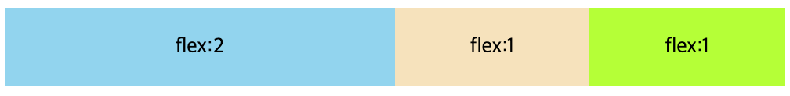

[source,html]
----

    
flex:2

    
flex:1

    
flex:1

----

* flex : none - 원래 지정된 공간을 차지
* flex : {숫자} - 나머지 공간을 다시 비율로 나눠서 차지

[source,html]
----

    
flex:2

    
flex:1

    
flex:1

----

* 원래 지정된 공간을 차지 즉 flex item 크기가 커지거나 작어지지 않습니다.
* 또한 flex container의 크기에 영향을 받지 않습니다.
* flex item의 원래 크기를 유지합니다.
* flex item3을 제외한 item1,item2을 기준으로 2:1 비율을 나눠서 차지 합니다.

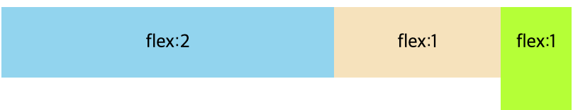

* flex-wrap: nowrap;
** 행의 줄 바꿈을 하지 않습니다. 한 줄로 표시합니다.
** `container width = 400px;`
** `chlid width = 100px * 5 = 500px;`

[source,html]
----

    
1

    
2

    
3

    
4

    
5

----

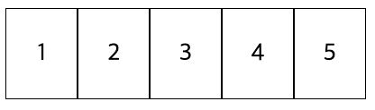

* flex:wrap
    ** flex 아이템이 flex 컨테이너 안에서 표시되도록, 줄 바꿈합니다.
    ** **container width = 400px;**
    ** **chlid width = 100px \* 5 = 500px;**

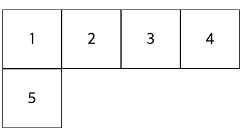

* justify-content: flex-start;
    ** Flex-direction과 같은 방향을 정렬
    ** justify-content: flex-start; default

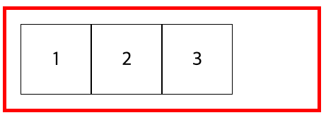

[source,html]
----

    
1

    
2

    
3

----

* justify-content: center;
** 흐름 방향(좌 -> 우)의 가운데에서 정렬

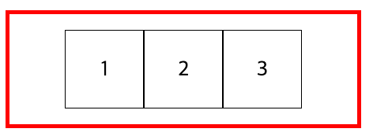

[source,html]
----

    
1

    
2

    
3

----

* justify-content: flex-end;
** 흐름 방향(좌 -> 우)의 끝에서 정렬

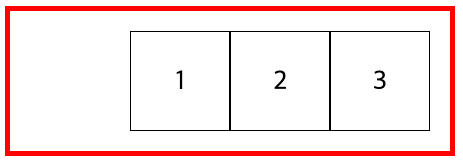

[source,html]
----

    
1

    
2

    
3

----

* align-items: flex-start; default
** 흐름 수직 방향의 시작에서 수직 정렬

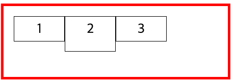

[source,html]
----

    
1

    
2

    
3

----

* flex: align -items: center
** 흐름 수직 방향의 가운데에서 수직 정렬
** align-items: flex-start; default

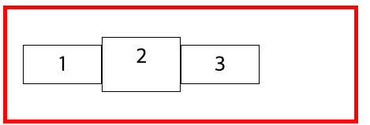

[source,html]
----

    
1

    
2

    
3

----

* align-items: flex-end;
* 흐름 수직 방향의 끝에서 수직 정렬

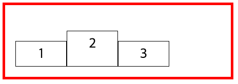

[source,html]
----

    
1

    
2

    
3

----
* 가로,세로 가운데 배치
* align-items: center;
* justify-content: center;

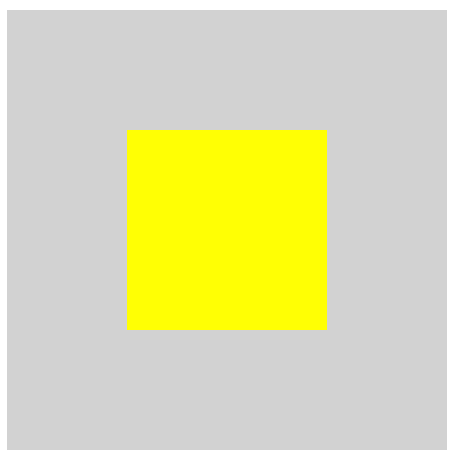

[source,html]
----

    

----

## Position

* position : static;<-- default
* left, right, top, bottom값 동작 안함

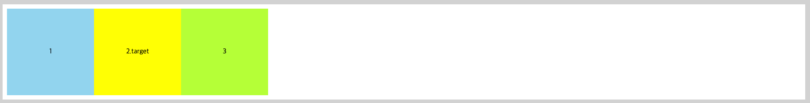

[source,html]
----

    
1

    
2.target

    
3

----

* position: relative;
* 원래 위치를 기준으로 이동

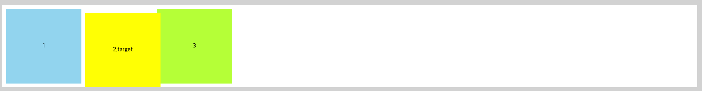

[source,html]
----
 

    
1

    
2.target

    
3

----

* .container <- position:absolute;
* .target <- position:absolute;
* position:relative를 가진 가장 가까운 상위 Element를 기준으로 위치

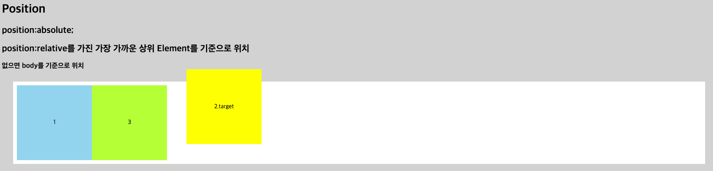

[source,html]
----

    
1

    
2.target

    
3

----

* position : fixed
** 해당위치에 고정

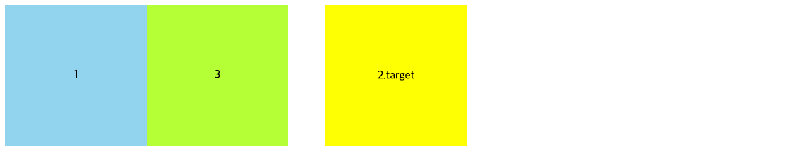

* 스크롤을 아래로 이동해보세요.
** 2.target <-- 고정 됩니다.

[source,html]
----

    
1

    
2.target

    
3

----