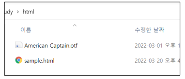
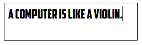
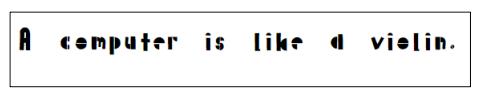
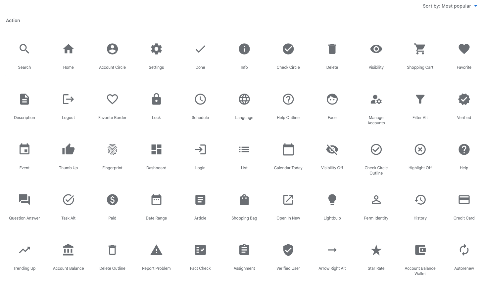

= 글자와 아이콘

== Font 적용

* 글자에 적용할 수 있는 속성

|===
|속성 |설명 |값 

|font-style |글자 스타일 |Normal | italic | oblique 
|font-weight |글자 굵기 |Lighter | normal | bold | border | 1 ~ 100 
|font-size |글자 크기 |&lt;숫자&gt;&lt;단위&gt; 
|font-family |글꼴 |글꼴 이름 
|line-height |기본 글꼴의 상대적인 크기 |normal | &lt;숫자&gt; | &lt;숫자&gt;&lt;단위&gt; 
|===

* 글자 크기 표현 단위

|===
|단위 |설명 

|px |화소 단위 
|em |부모 요소의 글자 크기 기준 배율 
|rem |HTML 글자 크기 기준 배율 
|pt |글꼴에 많이 쓰임 
|% |기본 글꼴의 상대적인 크기 
|vw,vh |뷰포트 기준 너비, 높이 
|===

== Font 적용

* 필요한 속성을 하나씩 적용

[source,css]
----
div {
    font-style: italic;
    font-weight: bold;
    font-size: .8em;
    line-height: 1.2;
    font-family: Arial, Helvetica, sans-serif;
}

----

* font 속성으로 한번에 적용

[source,css]
----
div {
    font: italic bold .8em/1.2 Arial, Helvetica,
    sans-serif;
}

----

== Web font

* 클라이언트 컴퓨터에 글꼴이 없을 경우 웹 폰트를 통해 다운로드 하게 할 수 있음
* 외부 font resources를 위한 링크 태그 또는 css의 import를 통해 받을 수 있음

== 클라이언트의 컴퓨터에 설치되지 않은 폰트를 사이트에서 사용

* 적용할 폰트의 경로와 이름 확인

* 적용할 경로와 이름 선언

[source,css]
----
@font-face {
    font-family: "American Captain";
    src: url(Captain.oft);
}
----

* 폰트 사용

[source,html]
----

A computer is like a violin.

----

== Web font - Google font

* https://fonts.google.com에서 웹 폰트 사용 가능
* 링크 태그 또는 css import를 통해 사용

[source,html]
----
@import url('https://fonts.googleapis.com/css2?family=Palette+Mosaic&display=swap');
div {
	font-family: 'Palette Mosaic', cursive;
	font-size: 20px;
}
----

== Web font 아이콘 활용

* Meterial-icon 사용
** 가이드 :https://developers.google.com/fonts/docs/material_icons
** 아이콘 :https://fonts.google.com/icons?selected=Material+Icons
** 백터 팡식으로 아이콘이 깨지지 않음
** 폰트 이므로 크기와 색상 조절 가능
** css 파일만 import하면 간단한 html  태그로 사용

[source,html]
----
<link href="https://fonts.googleapis.com/icon?family=Material+Icons" rel="stylesheet">
<body>
    face
    search
</body>
----

