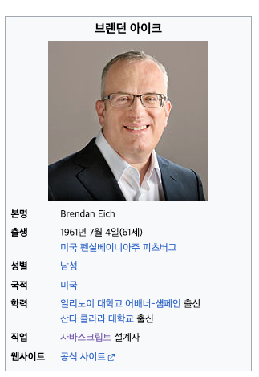
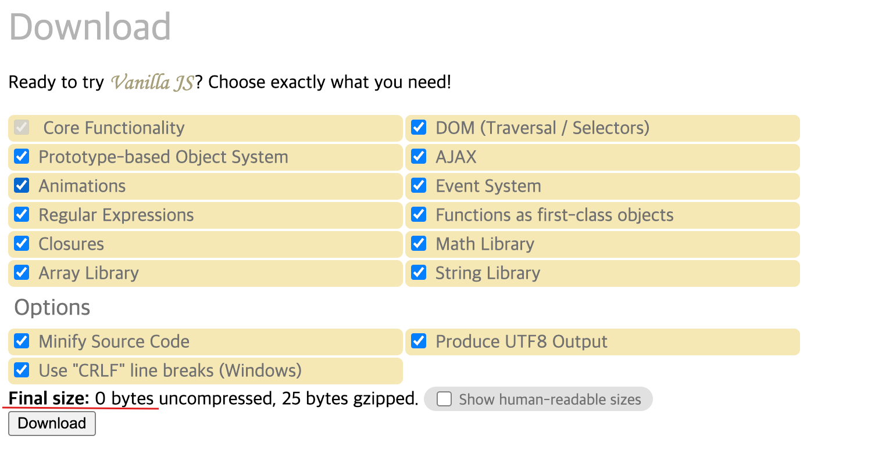
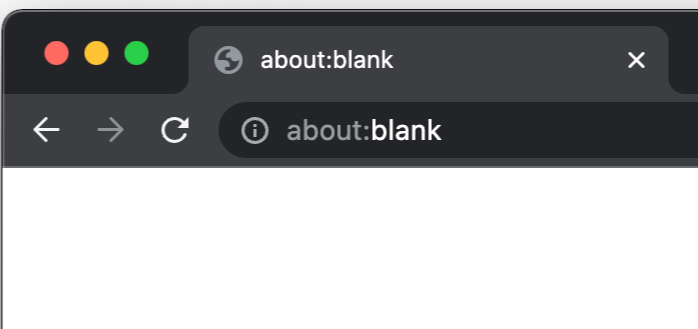

= JavaScript?

== JavaScript의 탄생

* *브렌던 아이크*

----
1995년, 약 90%의 시장 점유율로 웹 브라우저 시장을 지배하고 있던 넷스케이프 커뮤니케이션즈는 
웹페이지의 보조적인 기능을 수행하기 위해 브라우저에서 동작하는 경량 프로그래밍 언어를 도입하기로 결정한다. 
그래서 탄생한 것이 바로 브렌던 아이크(Brendan Eich)가 개발한 자바스크립트다.
----

== JavaScript 특징

* 웹 서버가 아닌 클라이언트 컴퓨터에 설치된 브라우저에서 실행되는  클라이언트 스크립트 언어 입니다.
* 웹 페이지에 기능을 더해 동적인 HTML 페이지를 만들 수 있습니다.
* 컴파일 과정이 없기 때문에 다른 언어에 비해 빠른 시간안에 작성할 수 있다.
* 단순한 구조로 초보 개발자도 쉽게 배우고 이해할 수 있다.
* 웹에 특화된 기술로 운영체제나 플랫폼에 상관없이 잘 동작하며, 확장성도 높다.

== ECMAScript 란?

* ECMA라는 기관이 만든 Script 언어
* ECMA-262 표준을 따르고 있음
** 자바스크립트를 개발한 Netscape가 더 향상된 표준화를 위해 기술 규격을 Ecma에 제출했고, 그에 따라 Ecma가 새롭게 제정한 표준을 ECMA-262라고 합니다.
** 즉 ECMA-262는 JavaScript 언어의 규격이며 ECMAScript는 ECMA-262 규격에 의해 표준화된 자바스크립트.

== ECMAScript 역사

* ECMAScript 역사
** https://ko.wikipedia.org/wiki/ECMA%EC%8A%A4%ED%81%AC%EB%A6%BD%ED%8A%B8
* JavaScript 역사
** https://ko.wikipedia.org/wiki/%EC%9E%90%EB%B0%94%EC%8A%A4%ED%81%AC%EB%A6%BD%ED%8A%B8
* 25 years of JavaScript history
** https://www.jetbrains.com/ko-kr/lp/javascript-25/

== 티오베 index

* https://www.tiobe.com/tiobe-index/

== Vanilla JS

* http://vanilla-js.com/
* 외부 라이브러리나 프레임워크를 쓰지 않는 순수 JavaScript
* Vanilla 는 비격식으로 "평범한","꾸미지 않은" 이라는 뜻을 가진 형용사 입니다.
* 즉 바닐라 자바스크립트는 핵심이 되는 아무것도 포함되지 않는 순수 자바스크립트를 함축적인 표현

== 학습환경 설정

* 브라우저 : chrome 브라우저
** https://www.google.co.kr/intl/ko/chrome/
* about:blank
** about:blank 페이지는 안전하지 않는 웹페이지로 인식합니다
** 즉 간단한 dom 관련된 테스트만 진행 합니다.
** localstorage, window , cookie 관련된 요청은 접근할 수 없습니다.

* WEB API
 ** https://developer.mozilla.org/ko/docs/Web/API/Console_API
 ** javascript 언어자체에는 포함되지 않지만 브라우져가 이해할 수 있는 API 입니다.

* 개발자 도구 ( 콘솔)
 ** 윈도우
 ** Ctrl + Shift +J
 ** MAC
 ** CMD + Option + J
* console 명령어
 ** console.log("hello")
 ** console log clear
 ** clear()
 ** console.table([0,1,2,3,4,5,6,7,8,9,10])
* 시간측정

[source,js]
----
console.time("sum");
let sum = 0;
for(let i=0; i<1000; i++){
    sum = sum + i;
}
console.timeEnd("sum");
----