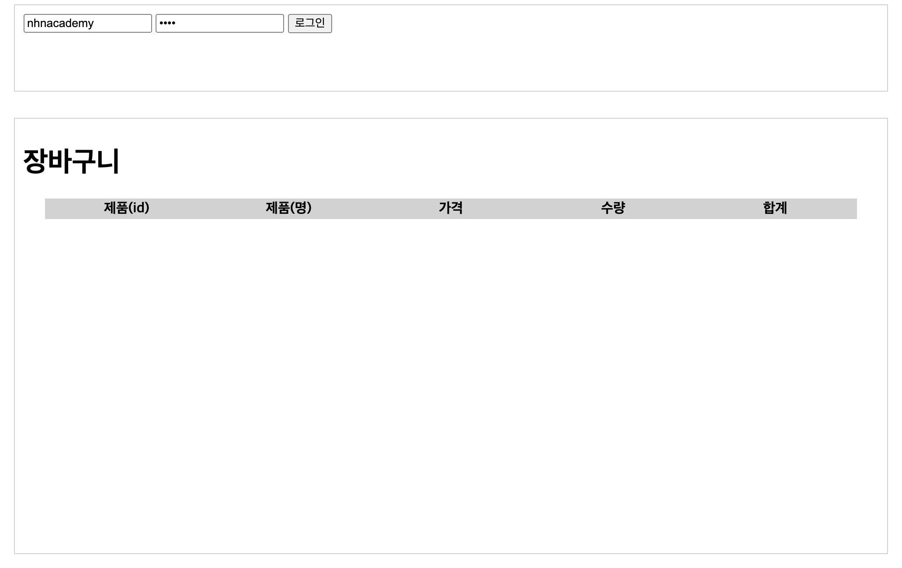
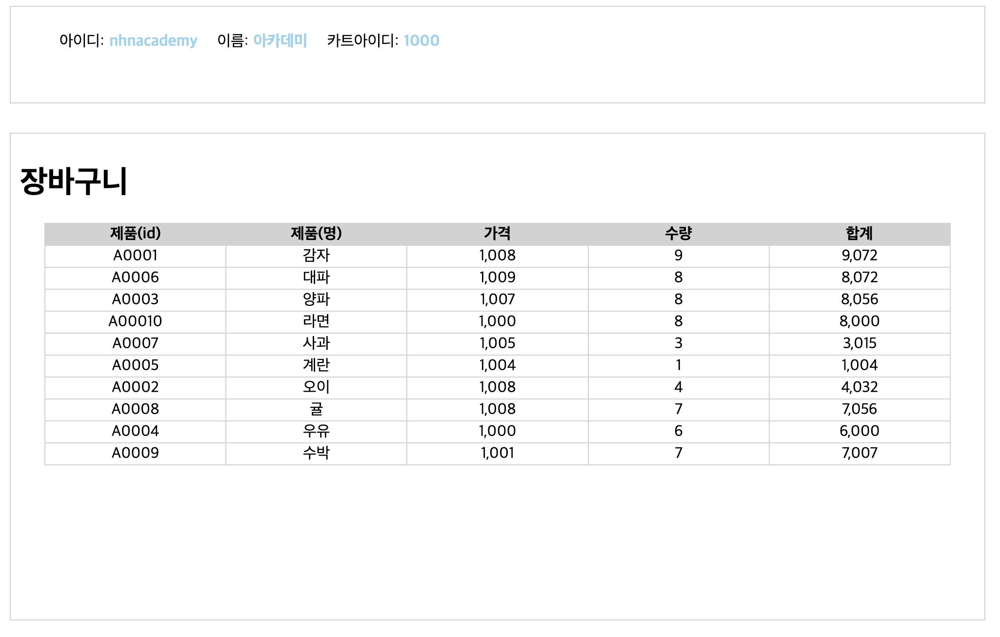
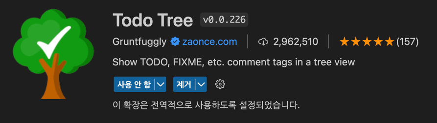

= 장바구니 조회

* 로그인에 성공하면 회원정보와 장바구니 리스트를 조회할 수 있는 간단한 예제
* 로그인(전), 로그인(후) 참고하여 UI 구현

== 로그인(전)

== 로그인(후)

== 구현

* 로그인 성공시 응답값을 참고하여 장바구니 리스트를 구현합니다.

[source,json]
----
{
"cartId" : 1000,
"userId" : "nhnacademy",
"userName" : "아카데미"
}
----

== Todo Tree 설치

* Visual Studio 확장 : 마켓플레이스

== 장바구니 조회 API
* link:api.adoc[장바구니 REST API]를 참고하여 구현합니다.

