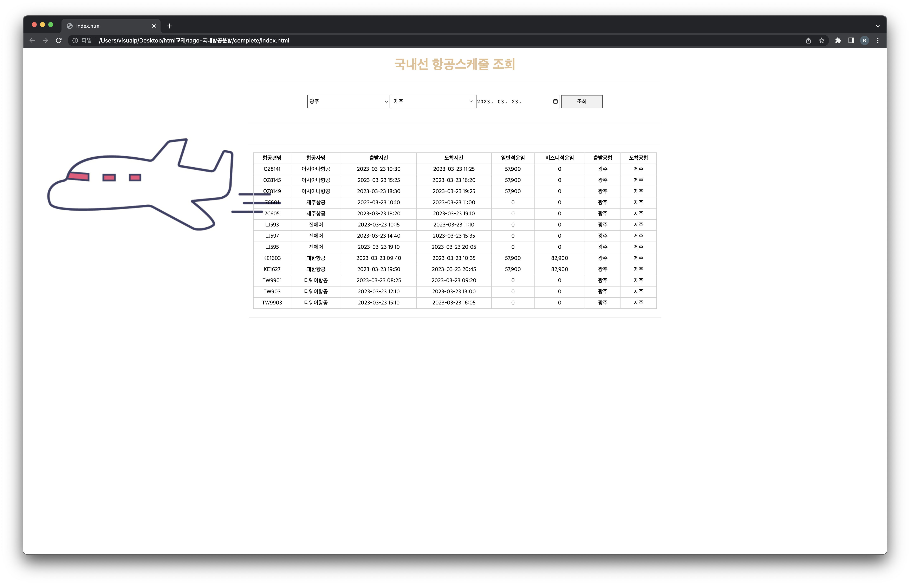

= UI 구성하기

* link:source/index.html[index.html] 파일은 제공해드린 파일을 사용합니다.
* css는 직접 작성합니다. (디자인은 마음대로 변경해보세요)
** link:source/style.css[style.css]를 사용해도 됩니다.
* link:source/api.js[api.js]
** todo 순서대로 구현합니다.

