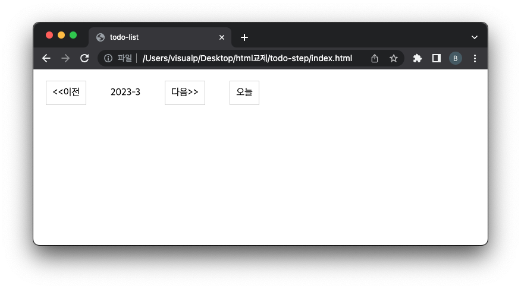

= Navigator 구현

== 파일 구성 ( `./source/` 하위 파일 )

* index.html
* style.css
* css는 적절하게 작성하기
* todo.js
* navigator.js

== navigator.js

[source,js]
----
/**
 * 함수명이 대문자로 시작하면 관례적으로 생성자 함수 입니다.
 * @param {*} uiBtnPrevMonthId 이전 button id
 * @param {*} uiBtnNextMonthId  다음 button id
 * @param {*} uiBtnCurrentMonthId 오늘 button id
 * @returns 
 */
function Navigator(uiBtnPrevMonthId, uiBtnNextMonthId, uiBtnCurrentMonthId){
    //TODO#0 strict mode 선언하기

    let year = null;
    let month = null;

    //TODO#1
    //생성자 함수의 parameter로 넘어오는 uiBtnPrevMonthId, uiBtnNextMonthId, uiBtnCurrentMonthId 초기화 해주세요

    /*
     //TODO#2
     //즉시 실행함수 : url 주소를 기준으로 year, month를 얻습니다.
     //url 주소 : ..../index.html?year=2023&month=04
     //year == null or year == null 이면 오늘 날짜로 설정합니다.
     //month <10 이면 01,02,03 .. 형태로 설정합니다.
     */

    // https://developer.mozilla.org/en-US/docs/Web/API/URLSearchParams/get
    const searchParam = new URLSearchParams(document.location.search);
    //TODO#2-1 query parameter 파싱해서 year, month 설정.

    // https://developer.mozilla.org/ko/docs/Web/JavaScript/Reference/Global_Objects/Date/getFullYear
    if(year == null){
        //TODO#2-2 year 설정

    }

    // https://developer.mozilla.org/ko/docs/Web/JavaScript/Reference/Global_Objects/Date/getMonth
    if(month == null){
        //TODO#2-3 month설정 0부터 시작 즉 1월은 = 0
    }

    //TODO#3
    //button event 설정 , DOMContentLoaded 시점에 ..
    window.addEventListener("DOMContentLoaded",function(){

        let btnPrevMonth = document.getElementById(uiBtnPrevMonthId);
        let btnNextMonth = document.getElementById(uiBtnNextMonthId);
        let btnCurrentMonth = document.getElementById(uiBtnCurrentMonthId);

        https://developer.mozilla.org/ko/docs/Web/JavaScript/Reference/Global_Objects/Error
        if(btnPrevMonth == null){
            //TODO#3-1 이전 button을 찾을 수 없다면 오류던지기
        }
        if(btnNextMonth == null){
            //TODO#3-2 다음 button을 찾을 수 없다면 오류던지기
        }
        if(btnCurrentMonth == null){
            //TODO#3-3 오늘 button을 찾을 수 없다면 오류던지기
        }

        //버튼 이벤트 등록
        //이전
        btnPrevMonth.addEventListener("click",function(){
            //TODO#3-4 이전 button click event 구현 : 이전 달 이동
            let targetYear=null;
            let targetMonth=null;
            //...

            _navigate(targetYear,targetMonth);
        });

        //다음
        btnNextMonth.addEventListener("click",function(){
            //TODO#3-5 다음 button click event 구현 : 다음 달 이동
            let targetYear=null;
            let targetMonth=null;
            //...

            _navigate(targetYear,targetMonth);
        });
        //오늘
        btnCurrentMonth.addEventListener("click",function(){
           //TODO#3-6 오늘 button click event 구현 : 이번 달 이동
            let targetYear=null;
            let targetMonth=null;
            //...

            _navigate(targetYear,targetMonth);
        });
    });

    //TODO#4
    function _navigate(targetYear,targetMonth){
       //페이지 이동 : ./index.html?year=2023&month=03
       //https://developer.mozilla.org/en-US/docs/Web/API/Location

    }
    //TODO#5 month or day -> d=9 return "09" 형태로 반환하는 함수구현
    //https://developer.mozilla.org/ko/docs/Web/JavaScript/Reference/Global_Objects/parseInt
    function _convertToZeroMonthAndDay(d){
       //...
        return d;
    }

    return {
        getYear : function(){
            return year;
        },
        getMonth : function(){
            return month;
        },
        convertToZeroMonthAndDay : function(d){
            return _convertToZeroMonthAndDay(d);
        }
    }

}

----

== parameters

* url은 다음과 같은 형태로 구성됩니다.
** year : 년
** month : 월

----
./index.html?year=2023&month=03
----

* query parameter 관련해서는 URLSearchParams api를 참고 합니다.
** https://developer.mozilla.org/en-US/docs/Web/API/URLSearchParams/get
* parameter가 존재하지 않는다면 다음과 같이 설정합니다.
** year : now year
*** https://developer.mozilla.org/ko/docs/Web/JavaScript/Reference/Global_Objects/Date/getFullYear
** month : now month
*** https://developer.mozilla.org/ko/docs/Web/JavaScript/Reference/Global_Objects/Date/getMonth