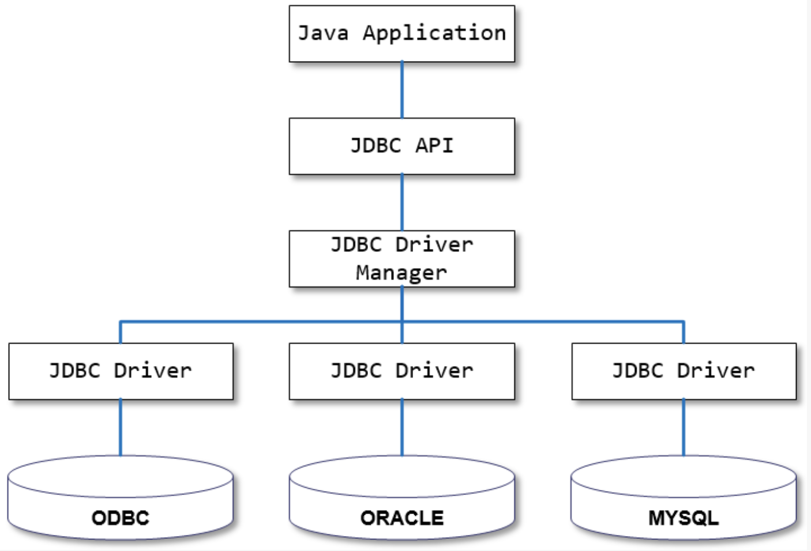

= JDBC

* JDBC(Java Database Connectivity)는 관계형 데이터베이스에 저장된 데이터를 접근 및 조작할 수 있게 하는 자바 API입니다.

* JDBC는 자바 응용프로그램이 다양한 DBMS에 대해 일관된 API로 데이터베이스 연결, 검색, 수정, 관리 등을 할 수 있게 한다.

* 그러므로 **자바 응용프로그램 개발자는 DBMS의 종류에 관계없이 JDBC API만을 이용하면 됩니다.**

== JDBC 구조

* JDBC는 네트워크상에 있는 데이터베이스에 접속할 수 있도록 해주는 데이터베이스 연결기능을 제공합니다.
* JDBC API, JDBC Driver, JDBC Driver Manager로 구성되어 있습니다.

|===
|구성요소 |설명 |역할

|Java Application |자바 응용프로그램, 자바 웹 애플리케이션 서버(tomcat, weblogic 등) |응용 프로그램 개발자, 웹 애플리케이션 서버 개발사
|JDBC API |자바 응용프로그램에서 데이터베이스를 연결하고 데이터를 제어할 수 있도록 데이터베이스 연결 및 제어를 위한 인터페이스와 클래스들 |JavaSE 개발사 (Sun microsystems, Oracle)
|JDBC Driver Manager |자바 응용프로그램이 사용하는 데이터베이스에 맞는 JDBC 드라이버를 찾아서 로드합니다. |JavaSE 개발사 (Sun microsystems, Oracle)
|JDBC Driver |각 데이터베이스 개발사에서 만든 데이터베이스 드라이버 |데이터베이스 개발사(Oracle, MySql, PostgreSQL..
|===

== JDBC 역사

* `Java 11`을 사용함으로 `JDBC 4.3` 사용 가능.

|===
|JDBC 버전 |발표 |자바 플랫폼 |중요한 변화

|JDBC 4.3 | 2017 |JavaSE 9  |support for sharding
|JDBC 4.2 | 2014 |JavaSE 8  |JDBC-ODBC 제거
|JDBC 4.1 | 2011 |JavaSE 7  |RowSet 1.1
|JDBC 4.0 | 2006 |JavaSE 6  |https://jcp.org/en/jsr/detail?id=221[JSR221]
|JDBC 3.0 | 2001 |JavaSE 1.4|https://jcp.org/en/jsr/detail?id=54[JSR54]
|JDBC 2.1 | 1999 |J2SE 1.27 |
|JDBC 1.2 | 1997 |J2SE 1.17 |
|===

== Reference
* https://www.herongyang.com/JDBC/Overview-JDBC-Version.html[Overview-JDBC-Version]
