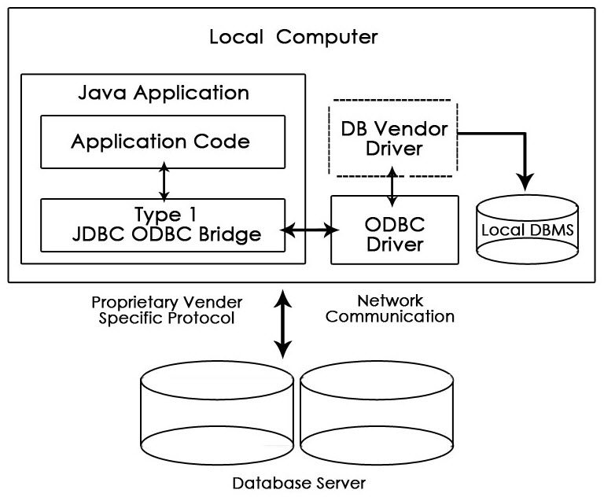
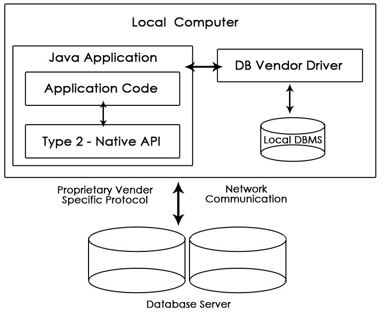
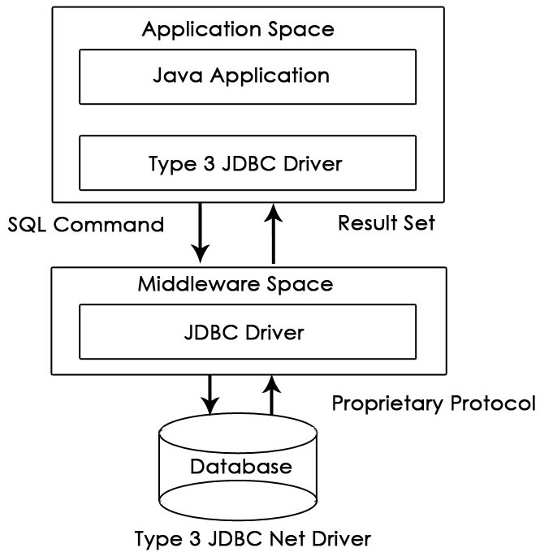
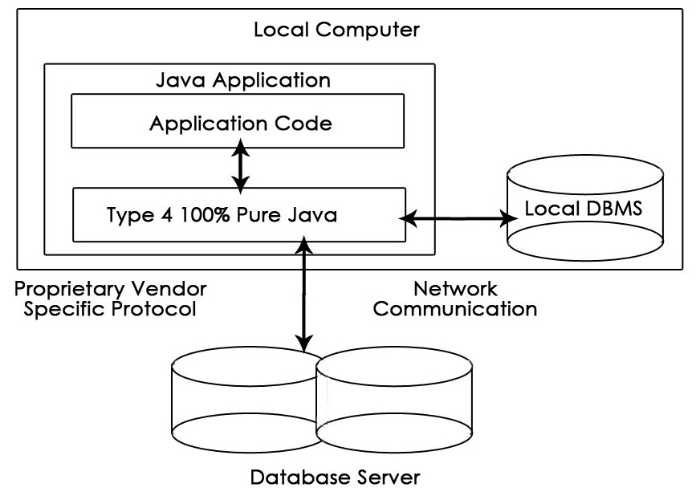

= JDBC Type

* JDBC Driver는 4가지 Type이 있습니다.

== Type-1 Driver or JDBC-ODBC Bridge
* JDBC와 ODBC 사이의 Bridge 역할을 합니다. JDBC 호출은 ODBC 호출로 변환한 다음 ODBC Driver에게 요청을 보냅니다.
** ODBC : https://github.com/microsoft/ODBC-Specification
** 마이크로소프트가 작성한 DBMS 접근 표준입니다.
* 사용하기는 쉽지만(간편하게 설정할 수 있지만), 실행시간이 느린 단점이 있습니다.

== Type-2 Driver or Native API Partly Java Driver
* Type2 JDBC 드라이버는 JNI(Java Native Interface)를 이용해서 데이터베이스 전용 네이티브 클라이언트를 호출합니다.
* `Type1` 에 비해서 실행속도가 빠른 편이지만 네이티브 라이브러리를 설치해야 하고 소프트웨어 관리/개발 비용이 증가합니다.
* 데이터베이스 제품을 바꾼다면 응용시스템에 많은 수정이 필요할 수 있습니다.

== Type-3 Network Protocal Driver ( fully java driver )
* Type3 JDBC 드라이버는 JDBC 미들웨어 서버와 독점 프로토콜로 통신합니다.
* JDBC 미들웨어는 요청된 프로토콜을 데이터베이스 호출로 변환합니다.
* 이 드라이버와 미들웨어는 데이터베이스 제품을 바꾸더라도 영향을 받지 않습니다. (Database Independent)
* 많은 네트워크 호출을 하므로 상대적으로 느린 편입니다.

== Type-4 Thin Driver ( fully java driver )

* Type4 JDBC 드라이버는 현재 가장 많이 쓰이는 형태입니다.
* 이 드라이버는 직접 데이터베이스와 통신하기 때문에 순수 자바 드라이버라고 말합니다.
* 네이티브 라이브러리 및 미들웨어 서버가 전혀 필요 없습니다.
* 다른 드라이버에 비해 가장 좋은 성능을 가지고 있습니다.

== Reference
* https://www.techarge.in/types-of-jdbc-drivers/
