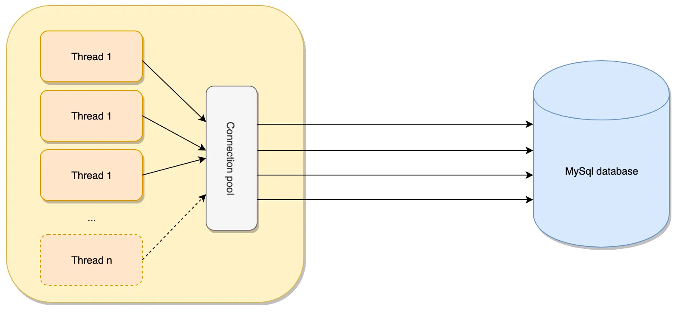
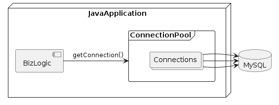

= Connection Pool

== Connection Pool이란?
* Connection Pool은 데이터베이스에 접근하기 위한 패턴.
** 미리 Connection 객체를 생성하여 Pool 또는 Container(tomcat)에 배치
** Application에서 Connection 객체가 필요할 때, 새로운 객체를 생성하는 대신 Pool에서 해당 객체를 가져와 사용하고 재사용을 위해서 사용된 객체는 Pool에 반납합니다.

== 장점
* 데이터베이스에 Connection을 생성할때 소요되는 시간 및 자원을 줄일 수 있습니다.
* Connection 수를 제한 할 수 있어 과다한 접속으로 인한 서버 자원 고갈을 예방합니다.
* 메모리 영역에서 Connection을 관리하기 때문에 클라이언트가 데이터베이스 작업을 빠르게 진행할 수 있습니다.

== Connection Pool 구현체 종류
* https://commons.apache.org/proper/commons-dbcp/[Apache Commons DBCP]
* https://github.com/swaldman/c3p0[C3P0]
* https://github.com/brettwooldridge/HikariCP[HikariCP]

== Connection Pool 구현?
. DataBase Driver를 사용하여 DataBase 연결
. 데이터 읽기/쓰기 위한 TCP/Socket Open
. Socket을 통해서 데이터 읽기/쓰기
. DataBase 연결 닫기
. TCP/Socket Close

____
DataBase에 연결하여 데이터를 읽기/쓰기 작업은 비용이(자원이) 많이 드는 작업입니다. 그러므로 DataBase 연결 작업을 최소화해야 합니다.
____

== Reference
* https://www.baeldung.com/java-connection-pooling[java connection pooling]
