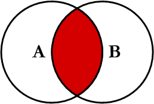
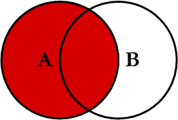
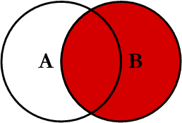
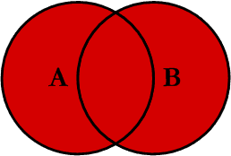
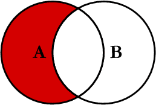
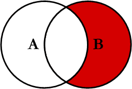
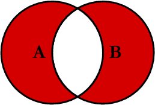

== Join

* 두 개 이상의 테이블 사이의 공통 필드를 기반으로 데이터 또는 행을 결합하는 데 사용합니다.

== INNER Join
* A ∩ B  (교집합)

[source,sql]
----
select * from TableA a
    INNER JOIN TableB b
        on a.key = b.key
----

== LEFT Join
* A ㅡ B (차집합)

[source,sql]
----
select * from TableA a
    LEFT JOIN TableB b
        on a.key = b.key
----

== RIGHT Join
* B ㅡ A (차집합)

[source,sql]
----
select * from TableA a
    RIGHT JOIN TableB b
        on a.key = b.key
----

== FULL Join

* A ∪ B (합집합)

[source,sql]
----
select * from TableA a
    FULL JOIN TableB b
        on a.key = b.key
----

* mysql 은 FULL JOIN을 지원하지 않습니다.
** *left join union right join 사용할 수 있습니다.*

[source,sql]
----
select * from TableA a
    LEFT JOIN TableB b
        on a.key = b.key
union

select * from TableA a
    RIGHT JOIN TableB b
        on a.key = b.key

----

== Left Excluding Join

[source,sql]
----
select * from TableA a
    LEFT JOIN TableB b
        on a.key = b.key
 where b.key is null
----

== Right Excluding Join

[source,sql]
----
select * from TableA a
    RIGHT JOIN TableB b
        on a.key = b.key
 where a.key is null
----

== Outer Excluding Join

[source,sql]
----
select * from TableA a
    FULL OUTHER JOIN TableB b
        on a.key = b.key
where a.key is null or b.key is null
----

* mysql은 FULL OUTHER JOIN을 지원하지 않습니다.
** Left Excluding Join + union + Right Excluding Join

[source,sql]
----

select * from TableA a
    LEFT JOIN TableB b
        on a.key = b.key
 where b.key is null

union

select * from TableA a
    RIGHT JOIN TableB b
        on a.key = b.key
 where a.key is null
----

== Reference
* https://www.codeproject.com/Articles/33052/Visual-Representation-of-SQL-Joins
