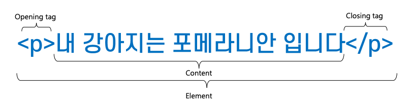
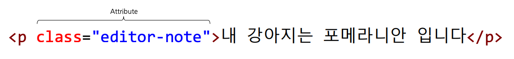
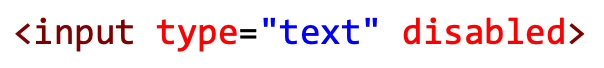
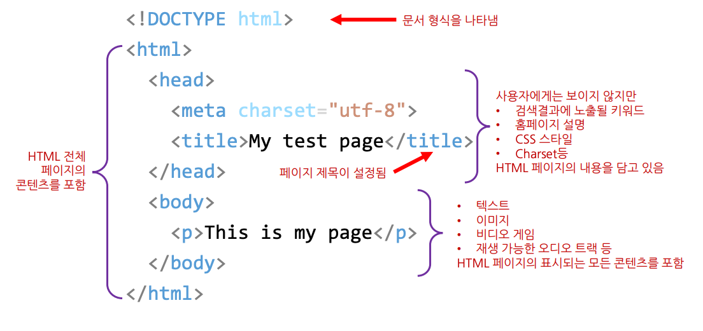
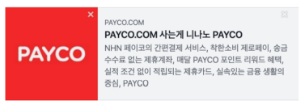
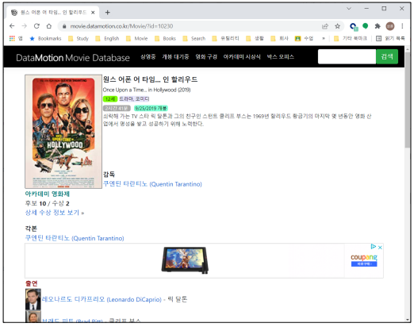

= HTML이란?

* 웹 페이지가 어떻게 구조화 되어 있는지 브라우저가 알 수 있게 하는 마크업 언어
** Element(요소)로 구성
** 각 컨텐츠의 여러 부분을 감싸고 있음
** Tags를 이용하여 하이퍼링크를 생성하거나 단어를 강조하는 등의 여러 역할

== 평문

[source,html]
----
내 강아지는 포메라니안 입니다.
----

== Element

[source,html]
----

내 강아지는 포메라니안 입니다.

----

== HTML Element

=== 여는 태그( Opening tag )

* 요소의 이름과, 열고 닫는 꺽쇠 괄호로 구성. 태그 시작 부분부터 효과 적용

=== 닫는 태그(Closing tag)

* 요소의 앞에 슬래시(/)가 있는 것을 제외하면 여는 태그와 같음. 요소를 종료

=== Nested element

[source,html]
----

내 강아지는 포메라니안 입니다.

내 강아지는 <strong>포메라니안</strong> 입니다.

----

* 잘못된 사용
** tag open &amp; close 순서를 맞춰서 사용.
** 동작은 되지만 옳바른 사용법은 아님..

[source,html]
----

내 강아지는 <strong>포메라니안 입니다.
</strong>
----

== 속성 ( Attribute )

=== 요소에 실제로는 나타내고 싶지 않지만 추가적인 내용을 담고 싶을 때 사용

* 요소 이름 다음에 바로 오는 속성인 요소 이름과 속성 사이에 공백을 둠
* 하나 이상의 속성이 있는 경우 속성 사이에 공백
* 속성 이름 다음에는 등호(=)가 붙음
* 속성 값은 따옴표로 감싸야 함

== Custom Attribute

=== 요소에 실제로는 나타내고 싶지 않지만 추가적인 내용을 담고 싶을 때 사용(추가된 요소들은 javascript을 이용해서 활용할 수 있습니다.)

* order="1" 커스텀 속성을 추가 했습니다.

[source,html]
----

내 강아지는 포메라니안 입니다

내 강아지는 포메라니안 입니다

내 강아지는 포메라니안 입니다

내 강아지는 포메라니안 입니다

내 강아지는 포메라니안 입니다

----

== 공백과 특수 문자

=== HTML은 공백을 표시하지 않음

[source,html]
----

This is my page

This is my
		page		

----

=== 예약문자

* &
* <, >
* –

* more...
** https://developer.mozilla.org/en-US/docs/Glossary/Entity#reserved_characters
** https://html.spec.whatwg.org/multipage/named-characters.html#named-character-references

=== HTML은 (newline or blank) 표시하려면?

* &lt;br/&gt;
** new line
* &amp;nbsp;
* 공백
[source,html]
----

This is my page

----

=== 주석

* 주석은 소스에는 존재하지만 화면에 표시되지 않습니다.

----
<!-- 
나는 주석입니다
 -->
----

== Boolean 속성

=== 

* 양식 요소에 입력하면 사용자가 데이터를 입력할 수 없도록 비 활성화

== HTML 문서의 구조

=== &lt;head&gt;&lt;/head&gt;

=== &lt;body&gt;&lt;/body&gt;

[source,html]
----
<!DOCTYPE html>
<html lang="ko">
    <head>
        <meta charset="utf-8"> <!-- meta data -->
        <title>My test page</title> <!-- page title -->
    </head>
    <body>
        
This is my page

    </body>
</html>
----

== DOCTYPE

=== 브라우저가 문서를 해석하는 방법 정의

=== HTML5

* 표준

[source,html]
----
<!DOCTYPE html>
----

=== XHTML 1.0

* Strict(엄격한 규칙)

[source,html]
----
<!DOCTYPE html PUBLIC "-//W3C//DTD XHTML 1.0 Strict//EN" "http://www.w3.org/TR/xhtml1/DTD/xhtml1-strict.dtd">
----

* Transitional(과도적인 규칙)

[source,html]
----
<!DOCTYPE html PUBLIC "-//W3C//DTD XHTML 1.0 Transitional//EN" "http://www.w3.org/TR/xhtml1/DTD/xhtml1-transitional.dtd">
----

* Frameset(프레임 사용 가능)

[source,html]
----
<!DOCTYPE html PUBLIC "-//W3C//DTD XHTML 1.0 Frameset//EN" "http://www.w3.org/TR/xhtml1/DTD/xhtml1-frameset.dtd">
----

=== XHTML 1.1

[source,html]
----
<!DOCTYPE html PUBLIC "-//W3C//DTD XHTML 1.1//EN"  "http://www.w3.org/TR/xhtml11/DTD/xhtml11.dtd">
----

=== HTML 4.01

* Strict(엄격한 규칙)

[source,html]
----
<!DOCTYPE HTML PUBLIC "-//W3C//DTD HTML 4.01//EN" "http://www.w3.org/TR/html4/strict.dtd">
----

* Transitional(과도적인 규칙)

[source,html]
----
<!DOCTYPE HTML PUBLIC "-//W3C//DTD HTML 4.01 Transitional//EN" "http://www.w3.org/TR/html4/loose.dtd">
----

* Frameset

[source,html]
----
<!DOCTYPE HTML PUBLIC "-//W3C//DTD HTML 4.01 Frameset//EN" "http://www.w3.org/TR/html4/frameset.dtd">
----

=== DOCTYPE을 생략한다면?

* 브라우저는 쿼크 모드 ( Quirks Mode )로 페이지를 렌더링 함
* 쿼크 모드에서는 이전 세대의 브라우저에 맞는 비표준적 방법의 CSS를 적용
* 쿼크 모드는 브라우저마다 렌더링 방식이 다름
* *결과적으로 크로스 브라우징 문제 발생*

== 문서의 시작과 끝 - html 태그

[source,html]
----
<!DOCTYPE html>
<html lang="ko">
    <head>
        <meta charset="utf-8">
        <title>My test page</title>
    </head>
	<body>
 	 <h1><a href="https://www.w3schools.com/tags/ref_language_codes.asp" target="_blank" >HTML Language Code Reference</a></h1>
            
웹 접근성을 준수하기 위함

            
검색SEO)과 음성장치에서 사용(시각장애인)

            
User-Agent가 언어를 바로 해석할 수 있도록 함

            
구글 번역기는 이 언어를 사용하여 번역을 도와줌

            
english

    </body>
</html>
----

=== &lt;html lang="ko"&gt;&lt;/html&gt;

* HTML 전체를 감싸는 태그
* lang 속성
** 웹 접근성을 준수하기 위함
** *검색(SEO)과 음성장치에서 사용*
** User-Agent가 언어를 바로 해석할 수 있도록 함
** 구글 번역기는 이 언어를 사용하여 번역을 도와 줌
** language code
*** https://www.w3schools.com/tags/ref_language_codes.asp

== &lt;head&gt;

* &lt;title&gt;
** 제목을 표시
* 파일 링크와 스크립트
** &lt;link rel="…" href="…" /&gt;
* JavaScript
** &lt;script&gt; 태그로 삽입

[source,html]
----
<!DOCTYPE html>
<html>
    <head>
        <title>Datamotion Movie Database</title>
        

        <link rel="stylesheet" href="./17.sample.css" />

        
    </head>
    <body>
        
head 요소의 내용은 브라우저에 표시되지 않음

        
title tag는 제목을 표시합니다.

    </body>
</html>
----

=== &lt;head&gt; 요소의 내용은 브라우저에 표시되지 않음

* 페이지에 대한 metadata를 포함
* 제목을 표시하는 &lt;title&gt;
[source,html]
----
<title>Datamotion Movie Database</title>
----

* 파일 링크와 스크립트
** CSS : &lt;style&gt; 태그로 사입
[source,java]
----

----

* &lt;link&gt; 태그로 파일 참조

[source,html]
----
<link rel="stylesheet" href="sample.css">
----

* JavaScript : &lt;script&gt; 태그로 삽입

[source,html]
----

----

* script src = 로 파일 참조

[source,html]
----

----

=== 페이지에 대한 메타 데이터를 포함

* 인코딩 설정

[source,html]
----
<meta charset="UTF-8">
----

* IE 호환성

[source,html]
----
<meta http-equiv="X-UA-Compatible" content="IE=edge">
----

* 페이지 설명

[source,html]
----
<meta name="keywords" content="movie">
<meta name="description" content="Simple Movie Database">
<meta name="author" content="Randy">
----

=== Open Graph Protocol 페이지에 대한 요약 정보

* 웹사이트가 OGP 를 지원한다면, 웹사이트를 들어가기도 전에 뭐하는 사이트인지 미리 알 수 있습니다.
* http://payco.com[payco.com]의 url을 카카오톡 or dooray 메신저에 붙여 넣으면 다음과 같이 확인 할 수 있습니다.

[source,html]
----
<meta name="og:url" content="http://www.payco.com">
<meta name="og:image" content=“http://image.toast.com/aaaaac/paycoNoti/payco_com.jpg">
<meta name="og:title" content="PAYCO.COM 사는게 니나노PAYCO">
<meta name="og:description" content="NHN 페이코의 간편결제 서비스, 착한소비 제로페이, 송금수수료 없는 제휴계좌, 매달 PAYCO포인트 리워드 혜택, 실적 조건 없이 적립되는 제휴카드, 실속있는금융 생활의 중심, PAYCO">
----

* 참고
** https://ogp.me/
** https://namu.wiki/w/%EC%98%A4%ED%94%88%20%EA%B7%B8%EB%9E%98%ED%94%84%20%ED%94%84%EB%A1%9C%ED%86%A0%EC%BD%9C

== &lt;body&gt;

=== 문서에서 사용자에게 표시되는 부분

[source,html]
----
<!DOCTYPE html>
<html lang="ko">
    <head>
        <meta charset="utf-8">
        <title>My test page</title>
    </head>

    <body>
        ...
    </body>

</html>
----

