= HTML Text

== 제목과 단락

* 대부분 구조화된 텍스트는 제목과 단락으로 구성
* HTML에서 각 단락은 `
` 요소

[source,html]
----

On May 1, barely siz months after the midterm elections, Donald Trump appears to have abandoned the White House and abdicated his role as president.

중간선거가 끝난 지 겨우 6개월 만인 5월 1일 도널드 트럼프는 백악관을 포기하고 대통령직을 사임한 것으로 보인다.

----

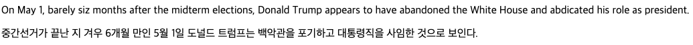

* 각 제목은 heading 요소 h1 ~ h6
** &lt;h1&gt;
** &lt;h2&gt;
** &lt;h3&gt;
** &lt;h4&gt;
** &lt;h5&gt;
** &lt;h6&gt;

[source,html]
----
<h1>h1 : 위기의 종식, 트럼프, 서둘러 백악관 출발!</h1>
<h2>h2 : 위기의 종식, 트럼프, 서둘러 백악관 출발!</h2>
<h3>h3 : 위기의 종식, 트럼프, 서둘러 백악관 출발!</h3>
<h4>h4 : 위기의 종식, 트럼프, 서둘러 백악관 출발!</h4>
<h5>h5 : 위기의 종식, 트럼프, 서둘러 백악관 출발!</h5>
<h6>h6 : 위기의 종식, 트럼프, 서둘러 백악관 출발!</h6>
----

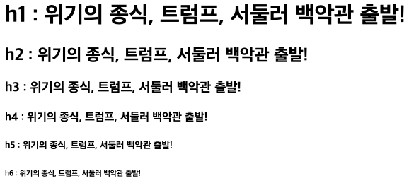

=== &lt;p&gt; : 문단

=== &lt;br&gt; : new line

[source,html]
----

Randall William Rhoads (December 6, 1956 – March 19, 1982) 
was an American heavy metal guitarist who was a founding member of Quiet Riot and both guitarist and co-songwriter for Ozzy Osbourne's first two solo albums.

Originally educated in classical guitar, Rhoads combined these early influences with heavy metal, helping to form a subgenre later known as neoclassical metal. With Quiet Riot, he adopted a black-and-white polka-dot theme which became an emblem for the group. He reached his peak as the guitarist for Ozzy Osbourne's solo career, performing on tracks including "Crazy Train" and "Mr. Crowley" on the Blizzard of Ozz album. "Crazy Train" features one of the most well-known heavy metal guitar riffs.

----

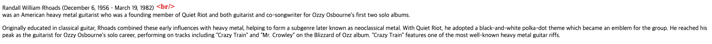

=== List

* 계층구조(목록)을 표현
* 순서 없는 목록 : &lt;ul&gt;, &lt;li&gt;

[source,html]
----
<ul>
    <li>우유</li>
    <li>계란</li>
    <li>빵</li>
    <li>후무스(중동의 김치)</li>
    <li>베이컨</li>
</ul>
----

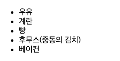

* 순서 있는 목록(Ordered) : &lt;ol&gt;, &lt;li&gt;

[source,html]
----
<ol>
    <li>Avatar</li>
    <li>Avengers: Endgame</li>
    <li>Titanic</li>
    <li>Starwars: Force Awaken</li>
    <li>Avengers: Infinity War</li>
</ol>
----

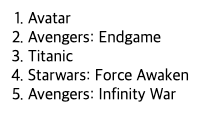
 

=== 중요(Emphasis)와 강조(Strong importance)

* 중요한 글자를 강조하기 위해 글자를 두껍게 표현하거나 기울여서 표현

[source,java]
----

<em>스래시 메탈</em> 밴드로는 <strong>메탈리카</strong>가 있습니다
 
그리고 <strong>메가데스</strong>또한 말하지 않을 수 없죠.

----

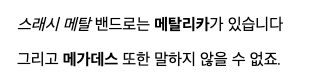

* `<b>` , `<i>` , `<u>`
** CSS가 잘 지원되지 않던 시절에 굵게, 기울임, 밑줄 등을 표현하기 위해 사용

[source,html]
----

<i>스래시 메탈</i> 밴드로는 <b>메탈리카</b>가 있습니다
 
그리고 <b>메가데스</b> 또한 <u>말하지 않을 수 없죠.</u>

----

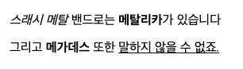

* &lt;strong&gt; vs &lt;b&gt; ?
** &lt;strong&gt; 요소는 콘텐츠 자체의 중요성을 강조할 때 사용됨
** &lt;b&gt; tag는 콘텐츠의 중요성 보다는 텍스트 자체에 주의를 끌기 위해서 사용됨

* &lt;blockquote&gt; : 블록인용구
** 인용구 ( 특별한 모양을 제공하지 않음 )

[source,html]
----
<h3>css의 정의</h3>
<blockquote cite="https://developer.mozilla.org/ko/docs/Learn/CSS/First_steps/What_is_CSS">
    
CSS 는 매우 기본적인 텍스트 문서 스타일링에 사용될 수 있습니다 예를 들어, 제목 및 링크의 색상과 크기 변경. 또한, 레이아웃을 만드는 데 사용 할 수 있습니다

</blockquote>
----

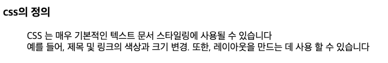
* &lt;q&gt; : 짧은 인용구

[source,html]
----

CSS의 정의는<q cite="https://developer.mozilla.org/ko/docs/Learn/CSS/First_steps/What_is_CSS">사용자에게 문서를 표시하는 방법을 지정하는 언어</q>입니다.

----

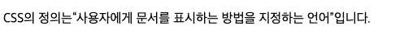
* 위 첨자 : &lt;sup&gt; (superscript)

[source,html]
----

My birthday is on the 25th of Jan 2001.

----

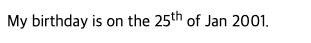
* 아래 첨자 : &lt;sub&gt; (subscript)

[source,html]
----

카페인 화학식: C8H10N4O2.

----

* &lt;address&gt; : 해당 문서의 연락 정보, 이탤릭체로 표현 됩니다.
[source,html]
----
<address>
	대왕판교로 645번길 16, 경기도, 성남시, 대한민국 13487 
	<b>NHN 플레이뮤지엄</b>
</address>
----

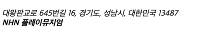
 
* 설명 리스트(Description List)

[source,html]
----
<dl>
    <dt>스트라토캐스터</dt>
    <dd>악기 브랜드 Fender사에서 생산하는 일렉트릭 기타</dd>

    <dt>레스폴</dt>
    <dd>악기 브랜드 Gibson사에서 생산하는 일렉트릭 기타</dd> 

    <dt>수퍼스트랫</dt>
    <dd>스트라토캐스터를 개조한 일렉트릭 기타</dd>
</dl>
----

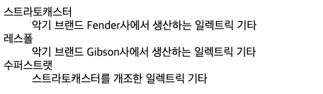
* 출처(Citations) : 특별한 모양을 제공하지 않음

[source,html]
----

폰 노이만의
  <cite><a href="https://en.wikipedia.org/wiki/Von_Neumann_architecture" target="_blank" >컴퓨터 구조</a></cite>에 따르면,

----

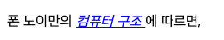

* 약어(abbr), Abbreviation

[source,html]
----

웹 문서의 구조를 만들때 <abbr title="Hypertext Markup Language">HTML</abbr>을 사용합니다

----

* HTML에 마우스를 올리면 다음과 같이 Full Text가 노출됩니다.

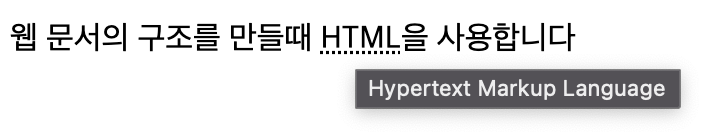

=== Code를 나타낼 때

* &lt;code&gt; : 일반적인 컴퓨터 코드를 나타냄

[source,html]
----
<pre>
    <code>
        var para = document.querySelector('p');
        para.onclick = function() {
            alert('Owww, stop poking me!');
        }
    </code>
</pre>
----

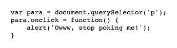

* *&lt;pre&gt; : 공백(일반적으로 코드 블록)을 유지하기 위해 사용*

* &lt;var&gt; : 변수 이름을 특별하게 표시

** 프로그래밍 또는 수학적 표현에서 변수를 정의하는 데 사용됩니다

[source,java]
----

In the above JavaScript example, <var>para</var> represents a paragraph element.

----

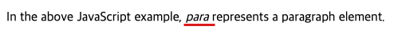

* &lt;kbd&gt; : 컴퓨터에 입력된 키보드 입력을 표시

[source,html]
----

Select all the text with <kbd>Ctrl</kbd>/<kbd>Cmd</kbd> + <kbd>A</kbd>.

<pre>$ <kbd>ping mozilla.org</kbd></pre>
----

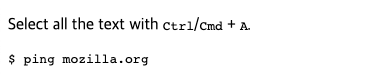

* &lt;samp&gt; : 컴퓨터 프로그램의 출력을 표시

[source,java]
----
<samp>PING mozilla.org (63.245.215.20): 56 data bytes 64 bytes from 63.245.215.20: icmp_seq=0 ttl=40 time=158.233 ms</samp></pre>
----

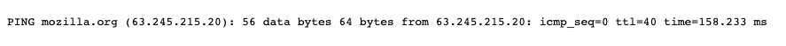

=== 시간과 날짜 표시

* 기계가 읽을 수 있는 명확한 시간/날짜 첨부
* 기본 문법
** YYYY : 2022 / 년
** MM : 09 / 월
** DD : 22 / 일
** hh : 19 / 시
** mm : 06 / 분
** ss : 15 / 초
[source,html]
----
<time datetime="YYYY-MM-DDThh:mm:ssTZD|PTDHMS">
----

* 다양한 사용방법

[source,html]
----
<!-- Standard simple date -->

<time datetime="2016-01-20">20 January 2016</time> <!-- Just year and month -->

<time datetime="2016-01">January 2016</time>

<!-- Just month and day -->

<time datetime="01-20">20 January</time>

<!-- Just time, hours and minutes -->

<time datetime="19:30">19:30</time>

<!-- You can do seconds and milliseconds too! --> <time datetime="19:30:01.856">19:30:01.856</time> <!-- Date and time -->

<time datetime="2016-01-20T19:30">7.30pm, 20 January 2016</time>

<!-- Date and time with timezone offset-->

<time datetime="2016-01-20T19:30+01:00">7.30pm, 20 January 2016 is 8.30pm in France</time>

<!-- Calling out a specific week number-->

<time datetime="2016-W04">The fourth week of 2016</time>

----

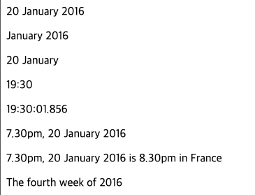