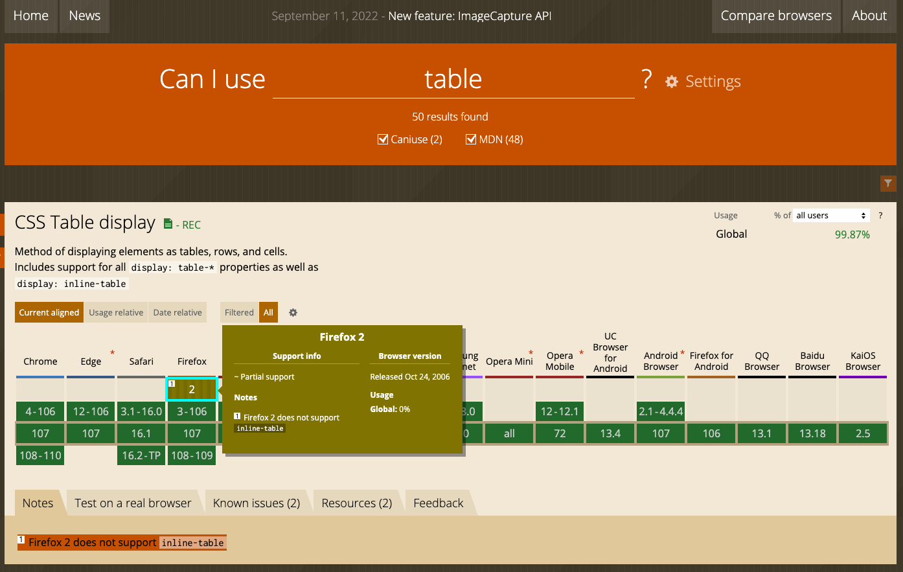

= 웹 표준,웹 호환성

== 웹 표준

* W3C에서 권고한 표준을 지켜 웹 사이트를 제작
* 물리적 또는 인적 환경에 제약 없는 접근성
* 마우스 또는 키보드가 없는 환경
* 시각적으로 문제가 있는 상황

== 웹 호환성

* 브라우저 종류와 비전에 관계없는 접근성
* 장치의 종류와 크기에 상관없는 호환성

=== 웹 호환성 확인

* Can I Use
** https://caniuse.com/

