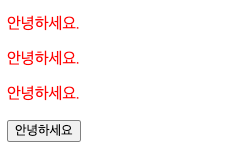
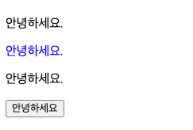
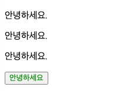
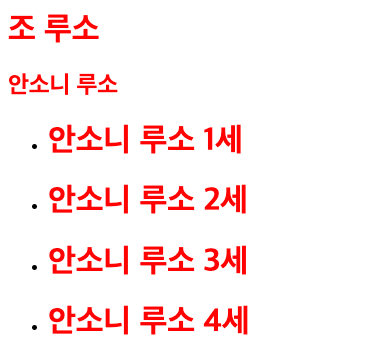
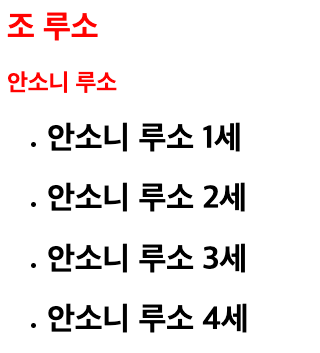
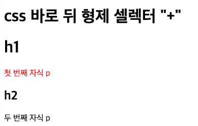
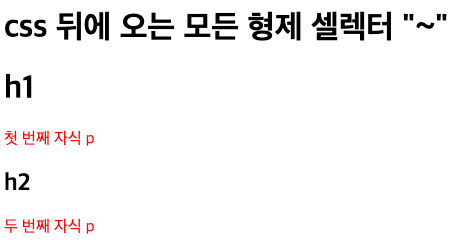
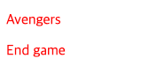
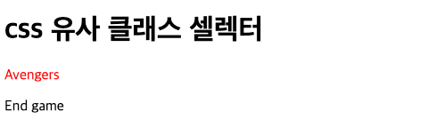
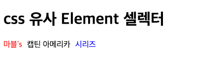

= Selector

* CSS를 적용할 요소를 지칭

== 테그 셀렉터

[source,html]
----
<style>
    p{
        color:red;
    }
</style>

<p>안녕하세요.</p>
<p id="hello">안녕하세요.</p>
<p class="hello">안녕하세요.</p>
<input type="button" value="안녕하세요">

----



== Id Selector

* Id 값 앞에 #을 붙여서 선택
* 우선순위 때문에 쓰지 않는 것이 좋음

[source,html]
----
<style>
    #hello{
        color:blue;
    }
</style>

<p>안녕하세요.</p>
<p id="hello">안녕하세요.</p>
<p class="hello">안녕하세요.</p>
<input type="button" value="안녕하세요">
----



== Class Selector

* Class앞에 '.'을 붙여서 선택
* 가장 많이 쓰이는 Selector

[source,html]
----
<style>
    .hello{
        color:green;
    }
</style>

<p>안녕하세요.</p>
<p id="hello">안녕하세요.</p>
<p class="hello">안녕하세요.</p>
<input type="button" value="안녕하세요">
----

== CSS 속성 셀렉터

* 대괄호 안에 속성명 = "값" 형태로 사용
* 대괄호 안에 속성명 형태로도 사용 가능

[source,html]
----
<style>
    [type="button"]{
        color: green;
    }
</style>

<p>안녕하세요.</p>
<p id="hello">안녕하세요.</p>
<p class="hello">안녕하세요.</p>
<input type="button" value="안녕하세요">
----



== 무모자식 관계 Selector

* html 문서는 부모 자식 관계가 있음
* header와 h1,h2는 부모-자식 관계
* h1 h2는 형제 과제

[source,html]
----
<header>
    <h1>조 루소</h1>
    <h2>안소니 루소</h2>
</header>
----

== 후손 Selector

* 부모와 후손을 선택 시 공백 사용
* 여러 개의 셀렉터를 적용할 때 콤마로 구분

[source,html]
----
<style>
    header h1{
        color:red;
    }
    header h1, header h2{
        color:red;
    }
</style>

<header>
    <h1>조 루소</h1>
    <h2>안소니 루소</h2>
    <ul>
        <li>
            <h1>안소니 루소 1세</h1>
        </li>
        <li>
            <h1>안소니 루소 2세</h1>
        </li>
        <li>
            <h1>안소니 루소 3세</h1>
        </li>
        <li>
            <h1>안소니 루소 4세</h1>
        </li>
    </ul>
</header>
----



== 자식 Selector

* 부모와 자식 선택 시 꺽쇠(>) 사용

[source,html]
----
<style>
    header > h1{
        color:red;
    }
    header > h1, header > h2{
        color:red;
    }
</style>

<header>
    <h1>조 루소</h1>
    <h2>안소니 루소</h2>
    <ul>
        <li>
            <h1>안소니 루소 1세</h1>
        </li>
        <li>
            <h1>안소니 루소 2세</h1>
        </li>
        <li>
            <h1>안소니 루소 3세</h1>
        </li>
        <li>
            <h1>안소니 루소 4세</h1>
        </li>
    </ul>
</header>
----



## 바로 뒤 형제 Selector
* 바로 뒤 형제 선택 시 사용

[source,html]
----
<style>
    h1 + p{
        color:red;
    }
</style>

<h1>h1</h1>
<p>첫 번째 자식 p</p>
<h2>h2</h2>
<p>두 번째 자식 p</p>
----




## 뒤에 오는 모든 형제 Selector
* 뒤에 오는 모든 형제 선택 시 \~ 사용

[source,html]
----
``` html
<style>
    h1 ~ p{
        color:red;
    }
</style>

<h1>h1</h1>
<p>첫 번째 자식 p</p>
<h2>h2</h2>
<p>두 번째 자식 p</p>
----



## 전체 Selector
* 모든 엘리먼트 선택 시 '*' 사용
* 성능에 좋지 않아 남발하지 않는 것이 좋음

[source,html]
----

<style>
    header * {
        color:red;
    }
</style>

or

<style>
    header p {
        color:red;
    }
</style>

or

<style>
    * {
        color:red;
    }
</style>

<header>
    <p>Avengers</p>
    <div>
        <p>End game</p>
    </div>
</header>

----




## 유사 클래스 Selector
* Element가 특별한 상태일 때를 선택
* 마우스가 올라가 있거나, 선택되어 있거나 등

[source,html]
----
<style>
    header  > p:hover  {
        color:red;
    }
</style>


<header>
    <p>Avengers</p>
    <div>
        <p>End game</p>
    </div>
</header>
----

* 마우스가 올라가면 색이 변경됨




|===

| 유사 클래스 셀렉터| 설명

| :hover| 마우스 오버

| :active| 선택된 상태

| :focus | 포커스가 있을 때
| :checked | 체크 상태일 때
| :disabled | 사용 불가능일 때
| :first-child, :last-child | 해당 요소 중 첫 번째, 마지막
| :nth-child(n) | 해당 요소 중 n 번째
| :nth-of-type(n) | 해당 요소 중 n 번째 엘리먼트
| ::not(셀렉터) | 해당 요소가 아닌 것들

|===


## 유사 Element Selector
* Element 내용의 앞과 뒤에 내용을 삽입
* 가상요소이므로  블록 지정이 안 됨
* 존재하는 Element가 없는 가상의 요소를 선택
* 유사 클래스는 상태를 선택하고, 유사 Element는 선택적인 부분을 선택
* 주로 문자열을 지정할 수 있는 content속성과 함께 사용
* 콜론 두 개(::)와 함께 사용

[source,html]
----
<style>
    div::before{
        content: "마블's";
        color:red;
        margin-right:10px;
    }
    div::after{
        content:"시리즈";
        color:blue;
        margin-left:10px;
    }
</style>

<div>캡틴 아메리카</div>
----



|===
| 유사 엘리먼트 셀렉터 | 설명
| ::first-letter | 첫 번째 글자
| ::first-line | 첫 번째 줄
| ::before | Element 내용의 앞
| ::after | Element 내용의 뒤
| ::selection | 선택된 글자
|===

## CSS 우선 순위

* 하나의 Element에 여러 가지 셀렉터로 선택이 가능
* 각 셀렉터로 지정한 스타일 중 우선순위에 따라 적용
* **클래스 셀렉터 > 태그 셀렉터**
* 셀렉터 우선순위 동등: 나중에 선언된 스타일 적용

[source,html]
----
<style>
        	main h1{
                color:yellow;
            }
            .title{
                color:red;
            }
            .title{
                color:blue;
            }
            .title{
                color:green;
            }
</style>

<main>
    <h1 class="title">오드리 헵번</h1>
</main>
----


## Id Selector를 적용하면?

[source,html]
----
<style>
        #title{
            color:aqua;
        }
         main h1{
            color:yellow;
        }
        .title{
            color:red;
        }
        .title{
            color:blue;
        }
        .title{
            color:green;
        }
</style>
----

