= 박스 모델 ( Box Model)

* 웹 문서의 내용을 박스 형태로 정의하는 방법이며, CSS 레이아웃의 기본이 되는 개념
* 브라우저가 Element를 렌더링 할 때 참고하는 값

== 박스 모델 구성 요소

* Margin : 바깥 여백
* Border : 테두리
* Padding : 안쪽 여백
* Content : 내용

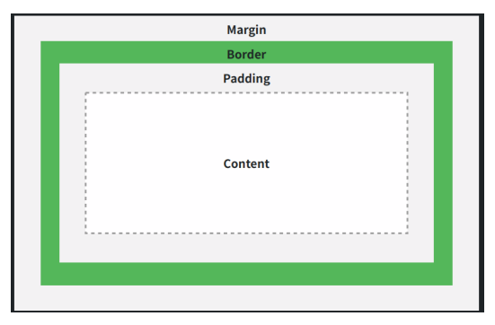

== Without the css box-sizing Property

* *width + padding + border = actual width of an element*
* *height + padding + border = actual height of an element*

== box-sizing : content-box

* 내용을 기준으로 Element 기준을 잡음
* border-left:20px;
* border-right:20px;
* content: 500px
* *total:540px*

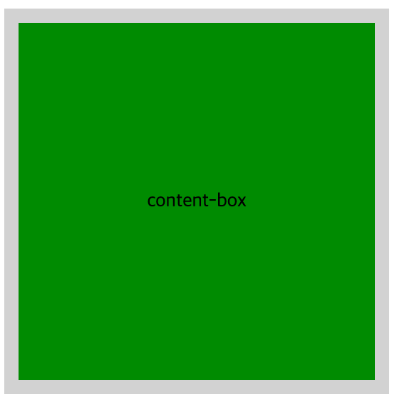

== box-sizing : border-box

* 테두리부터 기준으로 Element 크기를 잡음
** border-left:20px;
** border-right:20px;
** content = 460px
** *total:500px*

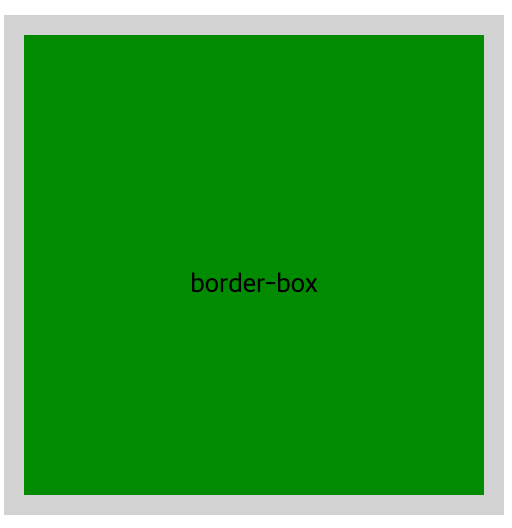

== background-clip

* 배경을 채워줄 범위 지정
* 박스 모델 구성요소를 살펴보기 좋은 속성

[source,html]
----
selector {
	background-clip: <background-clip 속성>;
}

----

|===
|Background-clip 속성 |설명 

|border-box |테두리 영역과 그 안쪽 영역 
|padding-box |안쪽 여백 영역과 그 안쪽 영역 
|content-box |내용 영역과 그 안쪽 영역 
|initial |기본 값으로 설정 
|inherit |부모 요소의 속성값을 상속 받음 
|===

[source,html]
----

background-clip: border-box;

background-clip: padding-box;

background-clip: content-box;

----

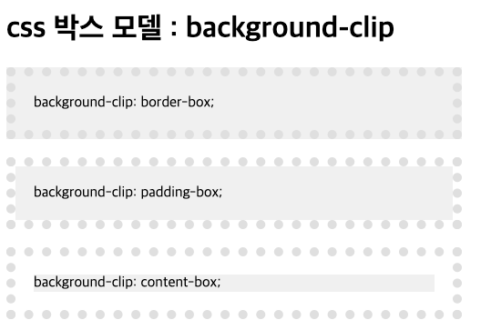

== width, height

* width
* height
* background

[source,html]
----

  

----

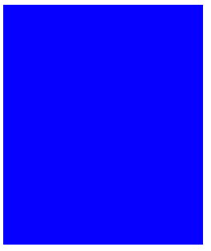

* width:100%

[source,html]
----

----

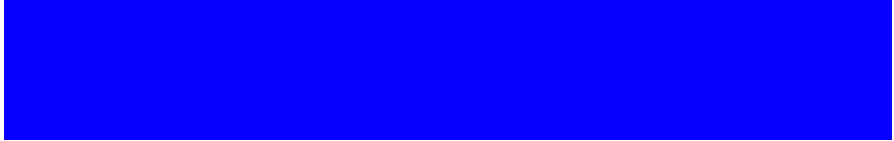

* max-width:300px;

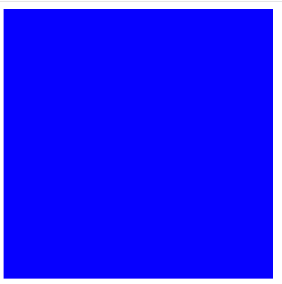

== margin과 padding

* 정의된 테두리 요소 주위에 여백을 만듦

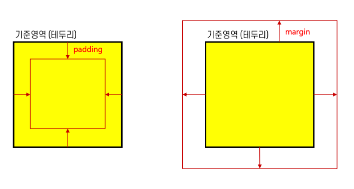

== margin

* 한 개 값: 상하좌우 값 설정

[source,css]
----
.center{
margin: 10px;
}
----

* 두 개 값 : 상하, 좌우 값 설정

[source,css]
----
.center{
    margin: 10px 0;
}
----

* 세 계 값 : 상, 좌우, 하 값 설정

[source,css]
----
.center{
margin: 10px; 5px; 0;
}
----

* 네 개 값 : 상, 우, 하, 좌 값 설정

[source,css]
----
.center{
    margin:10px 5px 5px 0;
}
----

[source,html]
----

    
header

    
left

    
center

    
right

    
footer

----

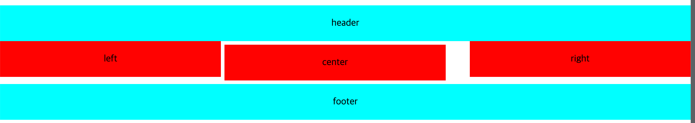

* 상하좌우 값을 따로 설정
* `margin-top:10px;` +
 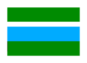
* `margin-left:10px;` +
 
* `margin-bottom:10px;` +
 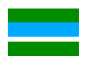
* `margin-right:10px;` +
 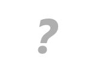

[source,html]
----

box

target

box

----

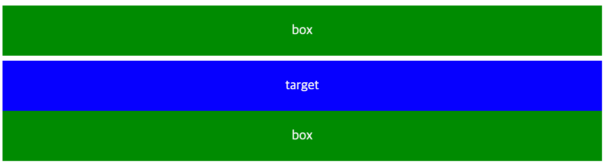

== padding

* 한 개 값 : 상하좌우 값 설정

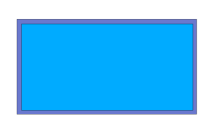

[source,html]
----
.box { padding:10px; }
----

* 두 개 값 : 상하, 좌우 값 설정

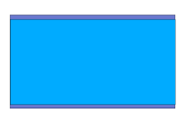

[source,html]
----
.box{ padding:10px 0; }
----

* 세 개 값 : 상, 좌우, 하 값 설정

image:./images/img_16.png[img_16.png]

[source,html]
----
.box{ padding:10px 5px 10px; }
----

* 네 개 값 : 상,우,하,좌 값 설정

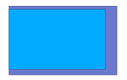

[source,html]
----
.box{ padding: 10px 5px 10px 5x; }
----

[source,html]
----

	

----

* 상하좌우 값을 따로 설정 ( padding )
** `padding-top:20px;`

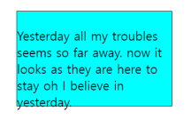

** `padding-bottom:10px;`

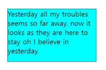

** `padding-left:10px;`

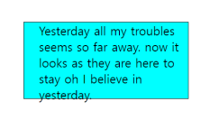

** `padding-right:10px;`

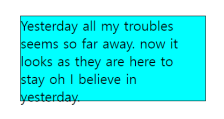

[source,html]
----

Yesterday all my troubles seems so far away. now it looks as they are here to stay oh I believe in yesterday.

----

== border

* 박스 모델의 테두리 지정
* line-style

|===
|Border-style 사용 가능 속성 |설명 

|`none` |hidden 키워드와 마찬가지로 테두리를 표시하지 않습니다. background-image를 지정하지 않았으면 해당 면의 border-width 계산값은 지정값을 무시하고 0이 됩니다. 표에서, 칸의 테두리 상쇄 시 none은 제일 낮은 우선순위를 가집니다. 따라서 주변 칸이 테두리를 가진다면 테두리를 그립니다.
|`hidden` |none 키워드와 마찬가지로 테두리를 표시하지 않습니다.Unless a background-image를 지정하지 않았으면 해당 면의 border-width 계산값은 지정값을 무시하고 0이 됩니다. 표에서, 칸의 테두리 상쇄 시 hidden은 제일 높은 우선순위를 가집니다. 따라서 주변 칸이 테두리를 가지더라도 그리지 않습니다.
|`dotted` |테두리를 둥근 점 여러개로 그립니다. 점 간격은 명세에서 지정하지 않으며 구현마다 다릅니다. 점의 반지름은 해당 면 border-width의 절반입니다. 
|`dashed` |테두리를 직사각형 여러개로 그립니다. 사각형의 크기와 길이는 명세에서 지정하지 않으며 구현마다 다릅니다. 
|`solid` |테두리를 하나의 직선으로 그립니다. 
|`double` |테두리를 두 개의 평행한 직선으로 그립니다. 
|`groove` |테두리가 파인 것처럼 그립니다.ridge의 반대입니다. 
|`ridge` |테두리가 튀어나온 것처럼 그립니다. groove의 반대입니다. 
|`inset` |요소가 파인 것처럼 테두리를 그립니다.outset의 반대입니다. border-collapse가 collapsed인 칸에서는 groove와 동일합니다. 
|outset |요소가 튀어나온 것처럼 그립니다. inset의 반대입니다. border-collapse가 collapsed인 칸에서는 ridge와 동일합니다. 
|===

[source,html]
----

<table>
    <tr>
      <td class="b1">none</td>
      <td class="b2">hidden</td>
      <td class="b3">dotted</td>
      <td class="b4">dashed</td>
    </tr>
    <tr>
      <td class="b5">solid</td>
      <td class="b6">double</td>
      <td class="b7">groove</td>
      <td class="b8">ridge</td>
    </tr>
    <tr>
      <td class="b9">inset</td>
      <td class="b10">outset</td>
    </tr>
  </table>
----

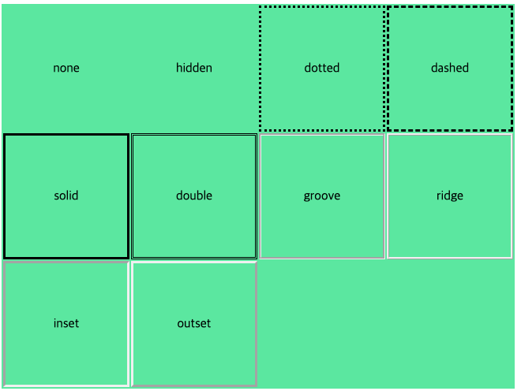

* 두께, 스타일, 색상 표시

[source,html]
----

----

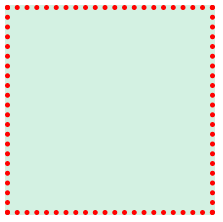

* 상, 하, 좌, 우 구분하여 표시

[source,html]
----

----

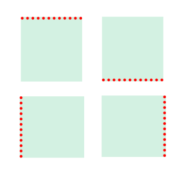

* Border-radius 테두리를 둥글게 만듦
 * `border-top-left-radius : 10px;` +
 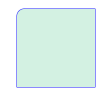

 * `border-top-right-radius : 10px;` +
 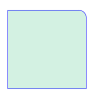

 * `border-bottom-left-radius : 10px;` +
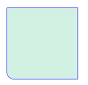

 * `border-bottom-right-radius : 10px;` +
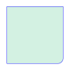

[source,html]
----

----

image:./images/img_29.png[img_29.png]