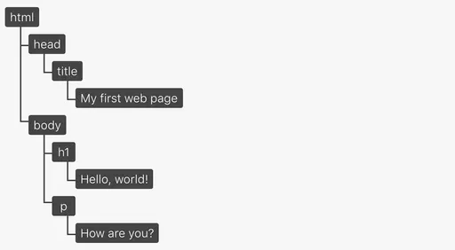

= DOM ( Document Object Model )

== 돔 ( DOM)이란?

* 웹 페이지를 이루는 테그들을 JavaScript가 이용 할 수 있게끔 브라우저가 트리구조로 만든 객체 모델입니다.
* DOM과 자바스크립트는 서로 떨어질 수 없는 관계라고 할 수 있습니다.
* DOM은 자체로 수행을 완료할 수 있는 것이 아니라 JavaScript가 DOM을 제어할 수 있도록 이벤트를 발생시키거나 객체에 접근하기 위한 경로를 제공해야 합니다.
* JavaScript는 DOM이 제공하는 메서드와 프로퍼티를 사용하여 데이터를 추출하거나 발생한 이벤트를 받아 추가적인 처리를 수행 합니다.

* create element , append element

[source,javascript]
----
const divElement = document.createElement("div");
divElement.id="myDiv";
divElement.innerHTML = 'div element!';
document.body.appendChild( divElement );
const textNode = document.createTextNode('text node!');
divElement.appendChild(textNode);
const myDiv = document.getElementById("myDiv");
myDiv.setAttribute("style","color:red");

----

* getElementsById

[source,javascript]
----
const h1Element = document.createElement("h1");
h1Element.id="heading";
h1Element.innerHTML = 'H1 element!';
document.body.appendChild(h1Element);
const h1 = document.getElementById("heading");
console.log("h1:" + h1);

----

* getElemenyByClassName

[source,javascript]
----
const brightElement1 = document.createElement("div");
brightElement1.setAttribute("class","bright");
brightElement1.innerHTML = 'bright-Element1';
document.body.appendChild( brightElement1 );

const brightElement2 = document.createElement("div");
brightElement2.setAttribute("class","bright");
brightElement2.innerHTML = 'bright-Element2';
document.body.appendChild( brightElement2 );

const brightDivList = document.getElementsByClassName("bright"); 
for(i=0; i<brightDivList.length; i++){
    console.log(brightDivList[i].innerHTML); 
}

----

* getElementsByTagName

[source,javascript]
----
let helloworld = `
    
hello world-1

    
hello world-2

    
hello world-3

`;
document.body.innerHTML = helloworld;
let pList = document.getElementsByTagName("p");
for(i=0; i<pList.length; i++){
    console.log(pList[i]);
}

----

* querySelector
** id 선택자처럼 반환값이 하나일 때

[source,javascript]
----
document.querySelector("#heading");
----

[source,html]
----
<h1 id="heading">H1 element!</h1>
----

* querySelectorAll
* class 선택자 또는 태그 처럼 반환값이 하나이상일 때

[source,javascript]
----
document.querySelectorAll(".bright");
document.querySelectorAll("p");
----

[source,html]
----

p1

p2

p3

----

== 주요이벤트

* 이벤트 등록
* https://developer.mozilla.org/ko/docs/Web/API/EventTarget/addEventListener
* EventTarget.addEventListener()

[source,javascript]
----

----

* 참고 :https://developer.mozilla.org/ko/docs/Web/Events

=== 마우스 이벤트

* *click*
** 포인팅 장치 버튼(모든 버튼; 주 버튼만 해당될 예정)이 엘리먼트에서 눌렸다가 놓였을 때.
** https://developer.mozilla.org/ko/docs/Web/API/Element/click_event
* dblclick
** 포인팅 장치 버튼이 엘리먼트에서 두 번 클릭되었을 때.
** https://developer.mozilla.org/en-US/docs/Web/API/Element/dblclick_event
* mousedown
** 포인팅 장치 버튼이 엘리먼트 위에서 눌렸을 때.
** https://developer.mozilla.org/en-US/docs/Web/API/Element/mousedown_event
* mousemove
** 포인팅 장치가 엘리먼트 우위에서 움직일 때.
** https://developer.mozilla.org/en-US/docs/Web/API/Element/mousemove_event
* mouseover
** 포인팅 장치가 리스너가 등록된 엘리먼트나 그 자식 엘리먼트의 위로 이동했을 때.
** https://developer.mozilla.org/en-US/docs/Web/API/Element/mouseover_event
* mouseup
** https://developer.mozilla.org/en-US/docs/Web/API/Element/mouseup_event

=== 키보드 이벤트

* keydown
** 키가 눌렸을 때
** https://developer.mozilla.org/ko/docs/Web/API/Document/keydown_event
* keyup
** 키 누름이 해제될 때
** https://developer.mozilla.org/en-US/docs/Web/API/Document/keyup_event

=== 문서 로딩 이벤트

* abort
** 리소스 로딩이 중단되었을 때.
** https://developer.mozilla.org/en-US/docs/Web/API/HTMLMediaElement/abort_event

* *load*
** 리소스와 그 의존 리소스의 로딩이 끝났을 때.
** https://developer.mozilla.org/ko/docs/Web/API/Window/load_event
** 초기 HTML 문서를 완전히 불러오고 분석했을 때 발생, 스타일 시트, 이미지, 하위 프레임의 로딩은 기다리지 않습니다.

* unload
** https://developer.mozilla.org/ko/docs/Web/API/Window/DOMContentLoaded_event
** 사용자가 사이트에서 떠나기 전에 사용자 분석 정보를 담은 통계자료를 전송하고자 할 때
** https://developer.mozilla.org/en-US/docs/Web/API/Window/unload_event

* resize
** 다큐먼트 뷰가 리사이즈되었을 때.
** https://developer.mozilla.org/ko/docs/Web/API/Window/resize_event
* scroll
** 다큐먼트 뷰나 엘리먼트가 스크롤되었을 때.
** https://developer.mozilla.org/en-US/docs/Web/API/Document/scroll_event

=== 폼 이벤트

* blur
** 엘리먼트의 포커스가 해제되었을때
** https://developer.mozilla.org/ko/docs/Web/API/Element/blur_event

* change
** 목록이나 체크사ㅏㅇ태 등이 변경이 되었을 때
** https://developer.mozilla.org/en-US/docs/Web/API/HTMLElement/change_event

* focus
** 폼 요소에 포커스가 놓였을 때
** https://developer.mozilla.org/en-US/docs/Web/API/Element/focus_event

* reset
** 폼이 다시 시작되었을 때
** https://developer.mozilla.org/en-US/docs/Web/API/HTMLFormElement/reset_event

* *submit*
** 폼이 전송되었을 떄
** https://developer.mozilla.org/en-US/docs/Web/API/HTMLFormElement/submit_event