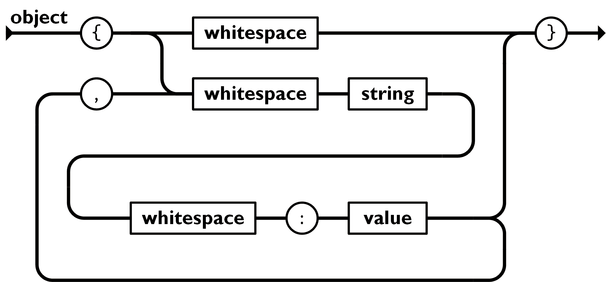
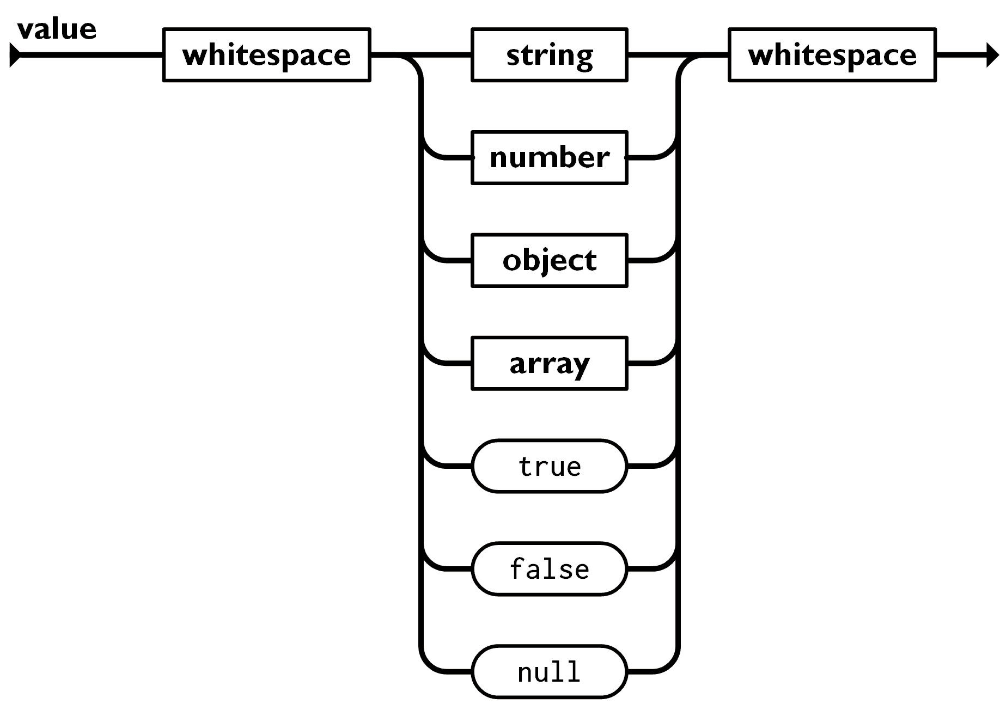
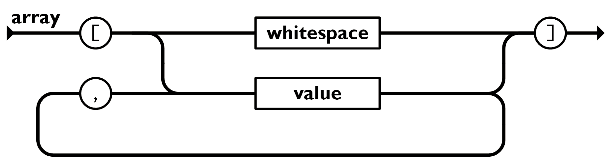

= JSON

* JavaScript Object Notation

== Json 구조?

* https://www.json.org/json-ko.html
* JSON 객체는 자바스크립트 객체와 마찬가지로 key/value가 존재할 수 있으며 키값이나 문자열은 쌍따옴표를 이용하여 표기해야 한다.

[source,js]
----
{
  userName:"marco",
  userAge:20,
}

----

* https://developer.mozilla.org/ko/docs/Web/JavaScript/Reference/Global_Objects/JSON
* JSON 형식에서만 null, number, string, array, object, boolean를 사용할 수 있다.

* Array은 값들의 순서화된 Collection 입니다. '[ ' left bracket로 시작해서 ']' right bracket로 표현합니다.

[source,javascript]
----
[
    {
        userName:"marco",
        userAge:20
    },
    {
        userName:"agnes",
        userAge:30
    },
    {
        userName:"petrus",
        userAge:40
    }
]
----

* json text -&gt; object로 변환 JSON.parse
* object -&gt; json text 변환 JSON.stringify
* json parser online.
** http://json.parser.online.fr/

[source,javascript]
----
let jsonStr='[
  {
    "name": "Molecule Man",
    "age": 29,
    "secretIdentity": "Dan Jukes",
    "powers": [
      "Radiation resistance",
      "Turning tiny",
      "Radiation blast"
    ]
  },
  {
    "name": "Madame Uppercut",
    "age": 39,
    "secretIdentity": "Jane Wilson",
    "powers": [
      "Million tonne punch",
      "Damage resistance",
      "Superhuman reflexes"
    ]
  }
]';
let jsonObj = JSON.parse(jsonStr);
console.log(typeof jsonObj);

let tempStr = JSON.stringify(jsonObj);
console.log(typeof tempStr);
----