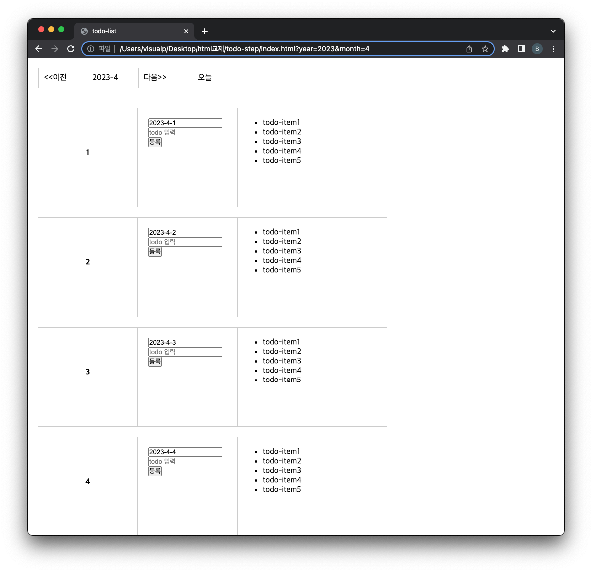

= Template

____

HTML `&lt;template&gt;` 요소는 페이지를 불러온 순간 즉시 그려지지는 않지만,
이후 JavaScript를 사용해 인스턴스를 생성할 수 있는 HTML 코드를 담을 방법을 제공합니다.

템플릿은 콘텐츠 조각을 나중에 사용하기 위해 담아놓는 컨테이너로 생각하세요.

페이지를 불러오는 동안 구문 분석기가 `&lt;template&gt;` 요소의 콘텐츠도 읽기는 하지만,
이는 유효성을 검증하기 위함이며 렌더링 하기 위함은 아닙니다.

____

== index.html

[source,html]
----
<!DOCTYPE html>
<html lang="ko">
    <head>
        <meta charset="UTF-8">
        <title>todo-list</title>
        <link rel="stylesheet" href="./style.css" />
        
        
        
        
    </head>

    <body>

        <ul id="todo-nav">
            <li><a href="#" onclick="movePrevMonth();">&lt;&lt;이전</a></li>
            <li>-</li>
            <li><a href="#" onclick="moveNextMonth();" >다음&gt;&gt;</a></li>
            <li><a href="#" onclick="moveToday();">오늘</a></li>
        </ul>

        <!-- .todo-item 담는 container-->
        

        

		<!-- template -->
        <template id="todo-item-template">
            

                
1

                

                    <form method="post" autocomplete="off" >
                        
<input type="text" name="todoDate" value="2023-3-13" readonly /> 

                        
<input type="text"   name="todoSubject" placeholder="todo 입력" />

                        
<button type="submit">등록</button>

                        
<button type="button" class="btn-remove-all">모두삭제</button>

                    </form>
                

                <ul class="todo-item-list">
                    <li>todo-item1</li>
                    <li>todo-item2</li>
                    <li>todo-item3</li>
                    <li>todo-item4</li>
                    <li>todo-item5</li>
                </ul>

            

        </template>

    </body>
</html>

----

== script.js

[source,javascript]
----
// todo-item-template 이용해서 todolist 만들기
function createTodoList(){

    const daysInMonth = getDaysInMonth(year,month);
    console.log("daysInMonth:" + daysInMonth);
    const todoItemWrapper = document.getElementById("todo-item-wrapper");
    const template = document.getElementById("todo-item-template");

    for(i=1; i<=daysInMonth; i++ ){
       //https://developer.mozilla.org/ko/docs/Web/API/Document/importNode
        const todoItem = document.importNode(template.content,true);
        const todoItemDay = todoItem.querySelector(".todo-item-day");

        //날짜표시
        todoItemDay.innerText="";
        const span1 = document.createElement("span");
        span1.innerText=i;
        todoItemDay.appendChild(span1);

        //form 날짜 설정 name=date
        //https://developer.mozilla.org/ko/docs/Web/API/Document/querySelector
        const todoDate = todoItem.querySelector("input[name=todoDate]");
        todoDate.value=year + "-" + month + "-" + i;

        //form 전송 event
        const form = todoItem.querySelector("form");
        form.addEventListener("submit",todoSubmit);

        const todoItemList = todoItem.querySelector(".todo-item-list");
        todoItemWrapper.appendChild(todoItem);
        //TODO#1 - 구현 .. 
    }
}

//ex) 2023-02 = 28일 , 2023-03 = 31 .. 해당달의 day count 구하기
function getDaysInMonth(targetYear, targetMonth){
    return new Date(targetYear, parseInt(targetMonth), 0).getDate();
}

// form event 처리
function todoSubmit(event){
    //TODO#2 - form 이벤트 구현
}
----