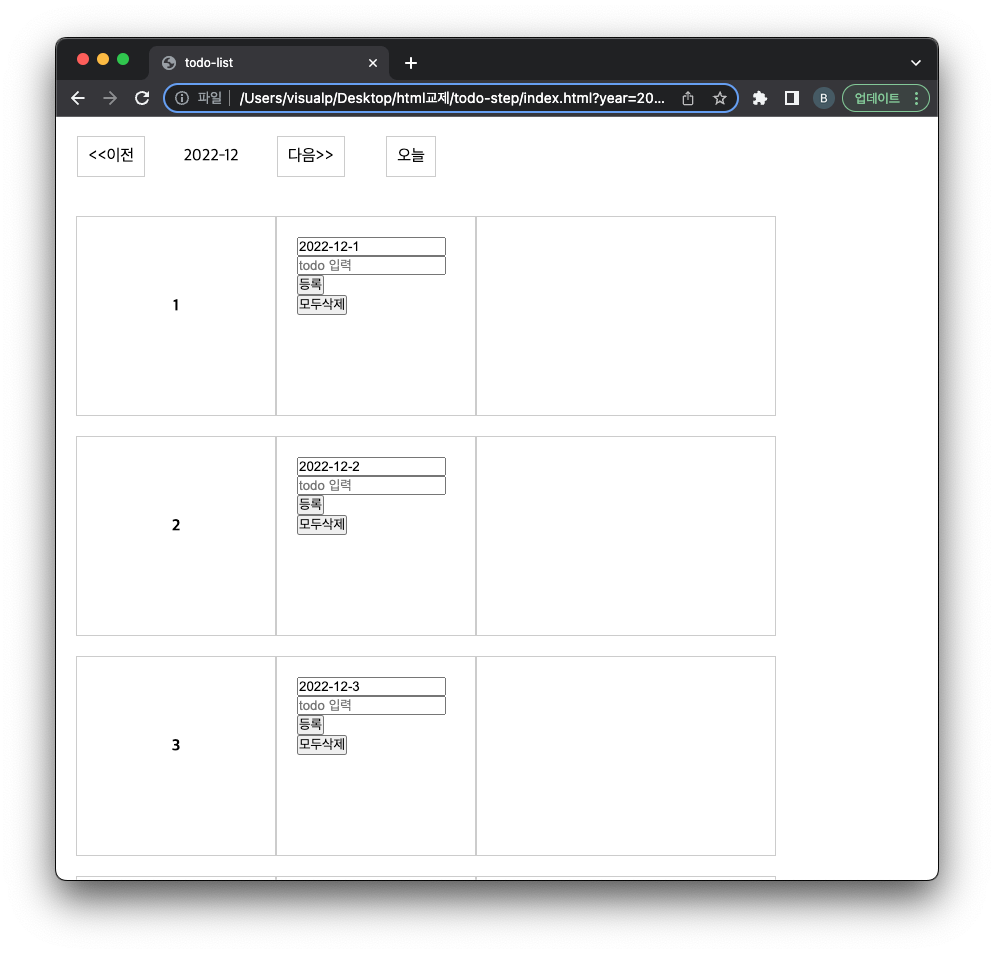

= Todo List 만들기

== 요구사항

* *디자인은(css) 적당히 .. 알아서 만들기*
** *기본적으로 제공되는 style.css을 사용합니다.*

* 일자별로 할 일 등록/삭제
** 하루에 최대 8개 등록 가능

* 모두삭제
** 일별로 등록된 모든 할일을 삭제합니다.

* optional
** 월,화,수,목,금,토,일 요일 표시하기
** 색상변경
*** 토요일 : 파랑
*** 일요일 : 빨강
*** 평일 : 검정

== 1단계

* memoryStore 만들기
* map, array를 저장소로 사용합니다.

== 2단계

* localStorageStore 만들기
* locaStorage를 저장소로 사용합니다.

== 3단계

* API SERVER와 연동합니다.

