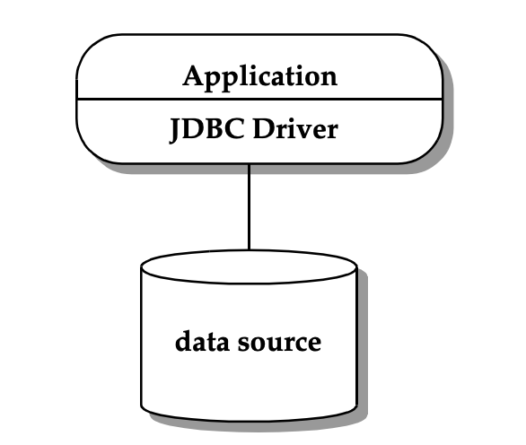
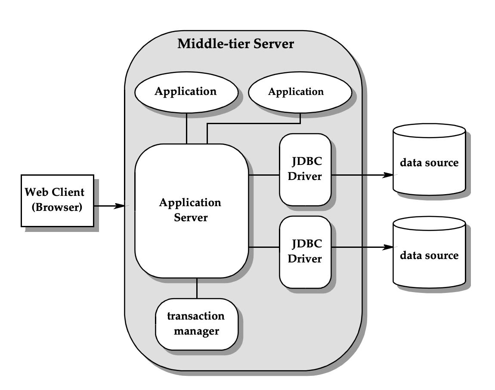

= JDBC Architecture

* JDBC를 사용하여 Two-Tier 또는 Three-Tier 아키텍처를 구성할 수 있습니다.

== Two-Tier Architecture
* Two-Tier 아키텍처는 Client Layer와 Server Layer로 구성됩니다.
* 이 아키텍처는 Java 응용 프로그램이 데이터베이스와 직접 통신하는 데 도움이 됩니다.
* 특정 데이터베이스와 통신하려면 JDBC 드라이버가 필요합니다.
* 쿼리 또는 요청은 사용자가 데이터베이스로 전송하고 결과는 사용자에 의해 다시 수신됩니다.
* 데이터베이스는 동일한 컴퓨터 또는 네트워크를 통해 연결된 원격 시스템에 있을 수 있습니다.
* 클라이언트 프로그램이 바로 데이터베이스에 접속하는 구성이라 확장성에 제한이 있습니다.
* 이 방법을 클라이언트-서버 아키텍처 또는 구성이라고 합니다.

== Three-Tier Architecture

* Three-tier 아키텍처는 비즈니스 로직을 담은 미들웨어가(Tomcat) 추가됩니다.
* 이 아키텍처는 사용자 PC에서 데이터베이스로 직접적인 통신은 없습니다.
* 사용자의 요청은 미들웨어로 전송됩니다.
* 예를 들면, 브라우저는 Java 응용 프로그램에 요청을 보낸 다음 데이터베이스로 추가로 전송됩니다.
* 데이터베이스는 요청을 처리하고 결과를 중간 계층으로 다시 보낸 다음 사용자와 통신합니다.
* 성능을 높이고 응용 프로그램 배포를 단순화합니다.

