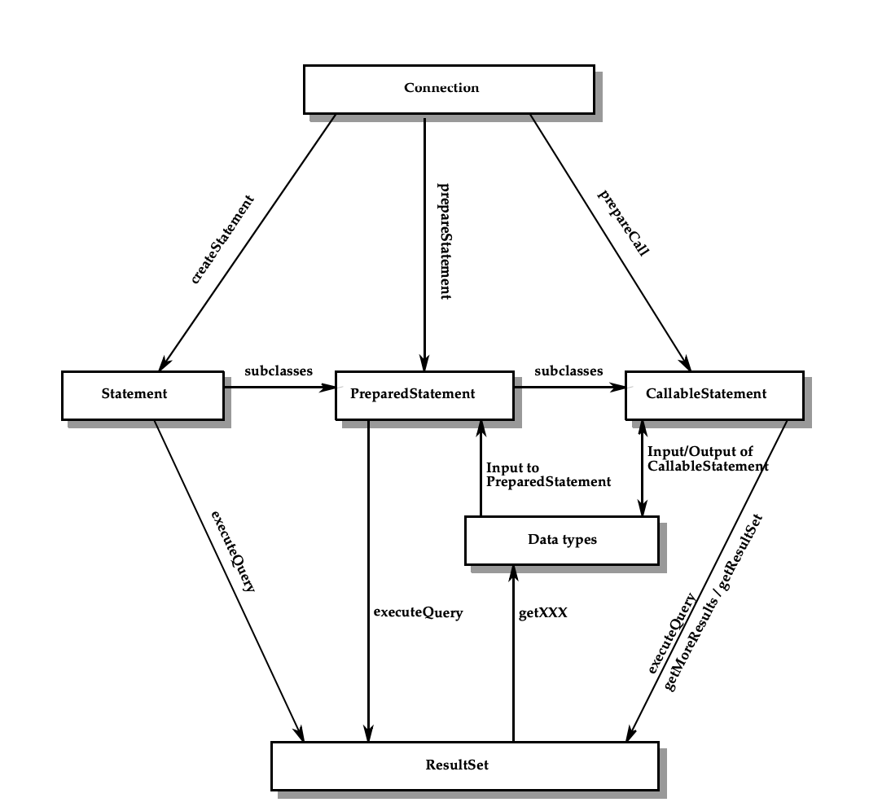
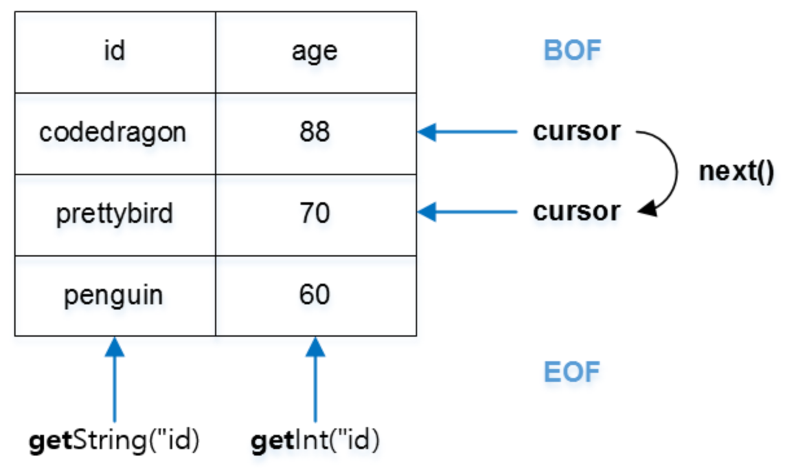

= Statement

* Java에서 SQL 문을 실행하기 위해서는 Statement 클래스를 이용하고, SQL 문 실행 결과를 얻어오기 위해서는 ResultSet 클래스를 이용합니다.

== Statement 사용
* SQL 문을 데이터베이스로 보내고 결과를 받기 위한 Statement 을 Connection 객체를 이용해서 생성합니다.

[source, java]
----
Statement statement = connection.createStatement();
ResultSet resultSet = statement.executeUpdate("select * from jdbc_students where id='marco'");
----

== Statement의 Methods( Query, Update )

=== executeQuery()
* SELECT 쿼리를 실행할 때 사용합니다.
* ResultSet 을 결과를 반환합니다.

=== executeUpdate()

* INSERT 등의 DDL을 실행하기 위해서 사용합니다.
* int 타입으로 성공 여부나 처리된 데이터 수를 반환합니다.

== ResultSet

* ResultSet 객체는 현재 데이터의 행(레코드 위치)을 가리키는 커서(cursor)를 관리합니다.
* 초기 값은 첫 번째 행 이전(Beginning Of File)을 가리키도록 되어있습니다.
* ResultSet 클래스는 주로 커서의 위치와 관련된 메소드와 레코드를 가져오는 메소드를 제공한다.

=== method

|===
|메소드 |설명

|boolean first() |커서를 첫 번째 행으로 이동
|boolean last() |커서를 마지막 행으로 이동
|boolean next() |커서를 다음 행으로 이동
|boolean previous() |커서를 이전 행으로 이동
|boolean absolute(int row) |커서를 지정된 행 row로 이동
|boolean isFirst() |첫 번째 행이면 true 반환
|boolean isLast() |마지막 행이면 true 반환
|void close() |ResultSet 객체의 데이터베이스와 JDBC 리소스를 즉시 반환
|Xxx getXxx(String columnLable) |Xxx는 해당 데이터 타입을 나타내며 현재 행에서 지정된 열 이름(columnLable)에 해당하는 데이터를 반환한다. 예를 들어, int형 데이터를 읽는 메소드는 getInt()이다.
|Xxx getXxx(int columnIndex) |Xxx는 해당 데이터 타입을 나타내며 현재 행에서 지정된 열 인덱스(columnIndex)에 해당하는 데이터를 반환한다. 예를 들어, int형 데이터를 읽는 메소드는 getInt()이다.
|===

* getString(String columnName)
** 현재 레코드에서 "columnName" 과 일치하는 컬럼 값을 문자열 타입으로 반환합니다.
* getInt(int n)
** 현재 레코드에서 n 번째 컬럼의 값을 정수형으로 반환합니다.
* getInt(String columnName)
** 현재 레코드에서 "columnName" 과 일치하는 컬럼 값을 정수형으로 반환합니다.
* getTimestamp(String columnLabel)
** 현재 레코드에서 "columnName" 과 일치하는 컬럼 값을 Timestamp 형으로 반환합니다.
** MySQL 에서 `DATETIME` 컬럼을 조회할때 사용할 수 있습니다.

=== ResultSet 을 이용한 결과가져오기

* ColumnIndex 를 이용한 결과

[source,java]
----
while(resultSet.next()) {
    System.out.println(resultSet.getLong(1));
    System.out.println(resultSet.getString(2));
    System.out.println(resultSet.getTimestamp(3));
}
----

* ColumnLabel 을 이용한 결과

[source,java]
----
while(resultSet.next()) {
    System.out.println(resultSet.getLong("id"));
    System.out.println(resultSet.getString("name"));
    System.out.println(resultSet.getTimestamp("created_at"));
}
----

=== ResultSet -  AutoCloseable
image::resources/image-03.png[]

== Closing Connection Objects (JDBC spec. 9.6.4)

=== Connection.close (JDBC spec 9.6.4.1)
* Connection.close() -> 연결종료.
* Connection 객체에의해서 생성된 모든 Statement 객체는 Connection 객체의 close 메서드가 호출될 때 함께 닫힙니다.
* Connection이 닫힌 후에는 'close()', 'isClosed()', 'isValid()' 메서드를 제외한 메서드를 호출하면 `SQLException` 이 발생함.

____
An application calls the method Connection.close() to indicate that it has
finished using a connection. All Statement objects created from a given
Connection object will be closed when the close method for the Connection
object is called.
Once a Connection has been closed, any attempt to access any of its methods with
the exception of the close(), isClosed() or isValid() methods will result in
a SQLException being thrown.
____

=== Connection.isClosed (JDBC spec 9.6.4.2)
* Connection.close() 메서드가 호출되었는지 확인할 수 있음
** *데이터베이스 연결이 유효한지를 판단하는 데 사용할 수 없음*

____
The Connection.isClosed() method indicates whether the method
Connection.close() has been called by an application. This method generally
cannot be used to determine whether a connection to a database is valid.
____

===  Connection.isValid (JDBC spec 9.6.4.3)
* Connection이 유효하면 true를 반환합니다.

____
The Connection.isValid() method indicates whether the Connection is still valid.
If Connection.isValid() returns true, the Connection is still valid. If a value of
false is returned, the Connection is not valid and any attempt to access any of its
methods with the exception of the close(), isClosed() or isValid() methods
will result in a SQLException being thrown.
____

== Reference
* https://download.oracle.com/otndocs/jcp/jdbc-4_3-mrel3-spec/index.html[JDBC 4.3 Specification]
