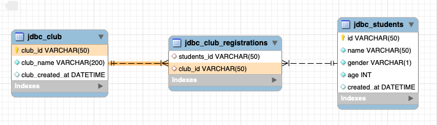

= Student - Club

== Branch
* 실습 : https://github.com/nhnacademy-bootcamp/jdbc-exercise/tree/exercise-student-club[exercise-student-club]
** todo#0 순서대로 진행합니다.
* 확인 : https://github.com/nhnacademy-bootcamp/jdbc-exercise/tree/student-club[student-club]

== ERD

* student는 0개 이상 club에 등록할 수 있습니다.
* club은 0명 이상의 학생이 등록할 수 있습니다.

== DDL Script

=== jdbc_studetns

* `jdbc_students` 이미 생성되어 있다면 생성할 필요 없음.

[source,sql]
----
CREATE TABLE `jdbc_students` (
  `id` varchar(50) NOT NULL COMMENT '학생-아이디',
  `name` varchar(50) NOT NULL COMMENT '학생-이름',
  `gender` varchar(1) NOT NULL COMMENT '성별 (M | F)',
  `age` int NOT NULL,
  `created_at` datetime DEFAULT CURRENT_TIMESTAMP,
  PRIMARY KEY (`id`)
) ENGINE=InnoDB DEFAULT CHARSET=utf8mb4 COLLATE=utf8mb4_0900_ai_ci COMMENT='학생';
----

=== jdbc_club
[source,sql]
----
CREATE TABLE `jdbc_club` (
  `club_id` varchar(50) NOT NULL,
  `club_name` varchar(200) CHARACTER SET utf8mb4 COLLATE utf8mb4_0900_ai_ci NOT NULL,
  `club_created_at` datetime DEFAULT CURRENT_TIMESTAMP,
  PRIMARY KEY (`club_id`)
) ENGINE=InnoDB DEFAULT CHARSET=utf8mb4 COLLATE=utf8mb4_0900_ai_ci;
----

==== jdbc_club_registrations

* *참조무결성* : *fk_club_id, fk_student_id*

[source,sql]
----
CREATE TABLE `jdbc_club_registrations` (
  `student_id` varchar(50) CHARACTER SET utf8mb4 COLLATE utf8mb4_0900_ai_ci DEFAULT NULL COMMENT '학생_아이디',
  `club_id` varchar(50) CHARACTER SET utf8mb4 COLLATE utf8mb4_0900_ai_ci DEFAULT NULL COMMENT 'club_아이디',
  KEY `club_registrations_pk` (`student_id`,`club_id`),
  KEY `fk_club_id` (`club_id`),
  CONSTRAINT `fk_club_id` FOREIGN KEY (`club_id`) REFERENCES `jdbc_club` (`club_id`) ON DELETE RESTRICT ON UPDATE RESTRICT,
  CONSTRAINT `fk_student_id` FOREIGN KEY (`student_id`) REFERENCES `jdbc_students` (`id`) ON DELETE RESTRICT ON UPDATE RESTRICT
) ENGINE=InnoDB DEFAULT CHARSET=utf8mb4 COLLATE=utf8mb4_0900_ai_ci;
----

== Test Code
* Test Code가 통과하도록 구현합니다.