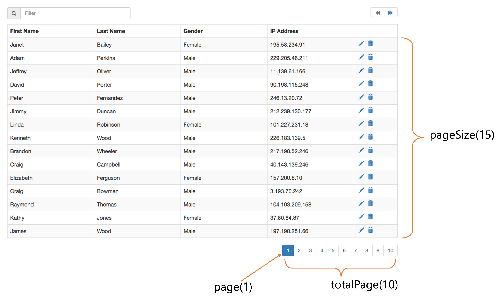

= Pagination

* Pagination이란 제공할 데이터는 많으나, 한 번에 다 보여줄 수 없을 때 사용할 수 있는 기능입니다.

== totalPage

----
전체 페이지(수) = 올림 ( 전제 로우(수) / pageSize )

예)
totalCount = 101;
pageSize=10;
[올림] 101 / 10;
totalPages = 11
----

[source,java]
----
totalPages = (totalCount==0)?1:(int)Math.ceil((double)totalCount/(double)pageSize);
----

== Select Statement

[source,sql]
----
SELECT
    [ALL | DISTINCT | DISTINCTROW ]
    [HIGH_PRIORITY]
    [STRAIGHT_JOIN]
    [SQL_SMALL_RESULT] [SQL_BIG_RESULT] [SQL_BUFFER_RESULT]
    [SQL_NO_CACHE] [SQL_CALC_FOUND_ROWS]
    select_expr [, select_expr] ...
    [into_option]
    [FROM table_references
      [PARTITION partition_list]]
    [WHERE where_condition]
    [GROUP BY {col_name | expr | position}, ... [WITH ROLLUP]]
    [HAVING where_condition]
    [WINDOW window_name AS (window_spec)
        [, window_name AS (window_spec)] ...]
    [ORDER BY {col_name | expr | position}
      [ASC | DESC], ... [WITH ROLLUP]]
    [LIMIT {[offset,] row_count | row_count OFFSET offset}]
    [into_option]
    [FOR {UPDATE | SHARE}
        [OF tbl_name [, tbl_name] ...]
        [NOWAIT | SKIP LOCKED]
      | LOCK IN SHARE MODE]
    [into_option]

into_option: {
    INTO OUTFILE 'file_name'
        [CHARACTER SET charset_name]
        export_options
  | INTO DUMPFILE 'file_name'
  | INTO var_name [, var_name] ...
}
----

=== [LIMIT {[offset,] row_count | row_count OFFSET offset}]
* offset : 첫 번째 행의 위치
* limit : offset으로부터 반환할 행의 수

=== offset은 0 부터 시작

[source, sql]
----
SELECT * FROM tbl LIMIT 5,10;  # Retrieve rows 6-15
----

===  n번째 행부터 마지막 행까지 반환 ( limit <-- 큰 수 사용)
* 96반쩨 헹부터 마지막 행까지 반환

[source,sql]
----
SELECT * FROM tbl LIMIT 95,18446744073709551615;
----

=== 처음 부터 n 번째 까지 반환

* 0~4 행까지 반환

[source, sql]
----
SELECT * FROM tbl LIMIT 5;     # Retrieve first 5 rows
----

=== Pagination
* total rows = 101
* pageSize=10
* totalPages = 11

----
select * from table limit 0,10
select * from table limit 1,10
select * from table limit 2,10
select * from table limit 3,10
select * from table limit 4,10
select * from table limit 5,10
select * from table limit 6,10
select * from table limit 7,10
select * from table limit 8,10
select * from table limit 9,10
select * from table limit 10,10
----

== Reference

* https://dev.mysql.com/doc/refman/8.0/en/select.html[MySQL Select, window=_blank]